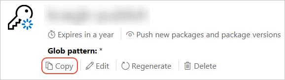

1. [Sign into your nuget.org account](https://www.nuget.org/users/account/LogOn?returnUrl=%2F) or create an account if you don't have one already.

   For more information on creating your account, see [Individual accounts](../../nuget-org/individual-accounts.md).

1. Select your user name (on the upper right), then select **API Keys**.

1. Select **Create**, provide a name for your key, select **Select Scopes > Push**. Enter * for **Glob pattern**, then select **Create**. (See below for more about scopes.)

1. Once the key is created, select **Copy** to retrieve the access key you need in the CLI:

    

> [!Warning]
> **Always keep your API key a secret!** Treat your API key as a password that allows anyone to manage packages on your behalf. You should delete or regenerate your API key if it is accidentally revealed.

> [!Important]
> Save your key in a secure location because you cannot copy the key again later on. If you return to the API key page, you need to regenerate the key to copy it. You can also remove the API key if you no longer want to push packages.

Scoping allows you to create separate API keys for different purposes. Each key has its expiration timeframe and can be scoped to specific packages (or glob patterns). Each key is also scoped to specific operations: push of new packages and updates, push of updates only, or delisting. Through scoping, you can create API keys for different people who manage packages for your organization such that they have only the permissions they need. For more information, see [scoped API keys](../../nuget-org/scoped-api-keys.md).