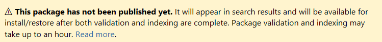
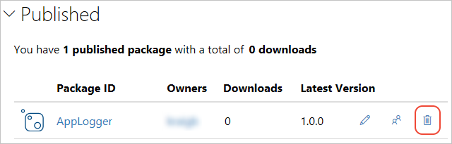
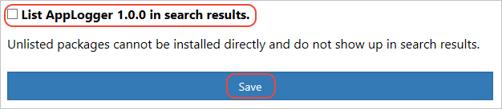

When your package successfully publishes, you receive a confirmation email. To see the package you just published, on [nuget.org](https://www.nuget.org/), select your user name at upper right, and then select **Manage Packages**.

> [!NOTE]
> It might take awhile for your package to be indexed and appear in search results where others can find it. During that time, your package appears under **Unlisted Packages**, and the package page shows the following message:
> 
> 

You've now published a NuGet package to nuget.org that other developers can use in their projects, but the sample package uses an empty class library that isn't useful. To *unlist* this test package and hide it from search results:

1. Once the package appears under **Published Packages** on the **Manage Packages** page, select the pencil icon next to the package listing.

   

1. On the next page, select **Listing**, deselect the **List in search results** checkbox, and then select **Save**.

   

The package now appears under **Unlisted Packages** in **Manage Packages** and no longer appears in search results.
