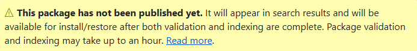

To manage your package after you've published it, follow these steps:

1. Sign into your nuget.org account, select your user name on the upper right of the page, and then select **API Keys** from the drop-down menu.

1. From the drop-down menu, select **Manage Packages** and then expand **Published Packages** to view your published packages. Each published package generates a confirmation email.

   It might take a while for your package to be indexed and appear in search results where others can find it. During that time, your package page displays the following message:

   

You've now published your first NuGet package to nuget.org that other developers can use in their own projects.

If you've created a package that isn't useful (such as a package created with an empty class library) or you decide you don't want the package to be visible, you can *unlist* the package to hide it from search results:

1. On nuget.org, select your user name, and then select **Manage Packages** from the drop-down menu.

1. Locate the package you want to unlist under **Published** and select the edit icon on the right:

    :::image type="content" source="../media/qs-create-vs-edit.png" alt-text="Screenshot showing a package listing on nuget.org.":::

1. On the next page, expand **Listing**, clear the box labeled **List in search results**, and then select **Save**:

    :::image type="content" source="../media/qs-create-vs-unlist.png" alt-text="Screenshot showing how to clear the List in search results checkbox for a package on nuget.org.":::
