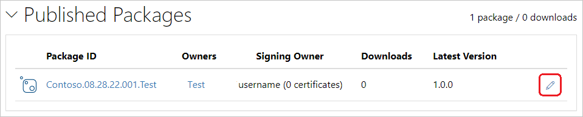
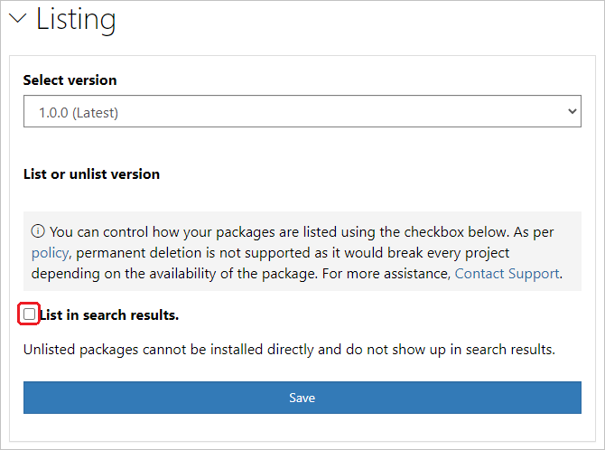

When your package successfully publishes, you receive a confirmation email. To see the package you just published, on [nuget.org](https://www.nuget.org/), select your user name at upper right, and then select **Manage Packages**.

> [!NOTE]
> It might take awhile for your package to be indexed and appear in search results where others can find it. During that time, your package appears under **Unlisted Packages**, and the package page shows the following message:
>
> 

You've now published a NuGet package to nuget.org that other developers can use in their projects.

If you've created a package that isn't useful (such as this sample package that was created with an empty class library), or you decide you don't want the package to be visible, you can *unlist* the package to hide it from search results:

1. After the package appears under **Published Packages** on the **Manage Packages** page, select the pencil icon next to the package listing.

   

1. On the next page, select **Listing**, deselect the **List in search results** checkbox, and then select **Save**.

   

The package now appears under **Unlisted Packages** in **Manage Packages** and no longer appears in search results.

> [!NOTE]
> To avoid your test package being live on nuget.org, you can push to the nuget.org test site at [https://int.nugettest.org](https://int.nugettest.org). Note that packages uploaded to int.nugettest.org might not be preserved.
