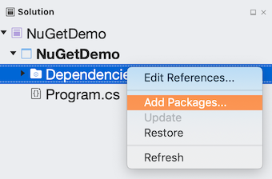

# Quickstart: Install and use a package in Visual Studio for Mac

NuGet packages contain reusable code that other developers make available to you for use in your projects. See [What is NuGet?](../What-is-NuGet.md) for background. Packages are installed into a Visual Studio for Mac project using the NuGet Package Manager. This article demonstrates the process using the popular [Newtonsoft.Json](https://www.nuget.org/packages/Newtonsoft.Json/) package and a .NET Core console project. The same process applies to any other .NET Core project.

Once installed, refer to the package in code with `using <namespace>` where \<namespace\> is specific to the package you're using. Once the reference is made, you can call the package through its API.

> [!Tip]
> **Start with nuget.org**: Browsing *nuget.org* is how .NET developers typically find components they can reuse in their own applications. You can search *nuget.org* directly or find and install packages within Visual Studio as shown in this article. For general information, see [Find and evaluate NuGet packages](../consume-packages/finding-and-choosing-packages.md).

## Prerequisites

- Visual Studio 2019 for Mac.

You can install the 2019 Community edition for free from [visualstudio.com](https://www.visualstudio.com/) or use the Professional or Enterprise editions.

If you're using Visual Studio on Windows, see [Install and use a package in Visual Studio (Windows Only)](install-and-use-a-package-in-visual-studio.md).

## Create a project

NuGet packages can be installed into any .NET project, provided that the package supports the same target framework as the project.

For this walkthrough, use a simple .NET Core Console app. Create a project in Visual Studio for Mac using **File > New Solution...**, select the **.NET Core > App > Console Application** template. Click **Next**. Accept the default values for **Target Framework** when prompted.

Visual Studio creates the project, which opens in Solution Explorer.

## Add the Newtonsoft.Json NuGet package

To install the package, you use the NuGet Package Manager. When you install a package, NuGet records the dependency in  either your project file or a `packages.config` file (depending on the project format). For more information, see [Package consumption overview and workflow](../consume-packages/Overview-and-Workflow.md).

### NuGet Package Manager

1. In Solution Explorer, right-click **Dependencies** and choose **Add Packages...**.

    

1. Choose "nuget.org" as the **Package source** in the top left corner of the dialog, and search for **Newtonsoft.Json**, select that package in the list, and select **Add Packages...**:

    

    If you want more information on the NuGet Package Manager, see [Install and manage packages using Visual Studio for Mac](../consume-packages/install-use-packages-visual-studio.md).

## Use the Newtonsoft.Json API in the app

With the Newtonsoft.Json package in the project, you can call its `JsonConvert.SerializeObject` method to convert an object to a human-readable string.

1. Open the `Program.cs` file (located in the Solution Pad) and replace the file contents with the following code:

    ```cs
    using System;
    using Newtonsoft.Json;

    namespace NuGetDemo
    {
        public class Account
        {
            public string Name { get; set; }
            public string Email { get; set; }
            public DateTime DOB { get; set; }
        }

        class Program
        {
            static void Main(string[] args)
            {
                Account account = new Account()
                {
                    Name = "Joe Doe",
                    Email = "joe@test.com",
                    DOB = new DateTime(1976, 3, 24)
                };
                string json = JsonConvert.SerializeObject(account);
                Console.WriteLine(json);
            }
        }
    }
    ```

1. Build and run the app by selecting **Run > Start Debugging**:

1. Once the app runs, you'll see the serialized JSON output appear in the console:

  

## Next steps
Congratulations on installing and using your first NuGet package!

> [!div class="nextstepaction"]
> [Install and manage packages using Visual Studio for Mac](/visualstudio/mac/nuget-walkthrough?toc=/nuget/toc.json)

To explore more that NuGet has to offer, select the links below.

- [Overview and workflow of package consumption](../consume-packages/overview-and-workflow.md)
- [Package references in project files](../consume-packages/package-references-in-project-files.md)
