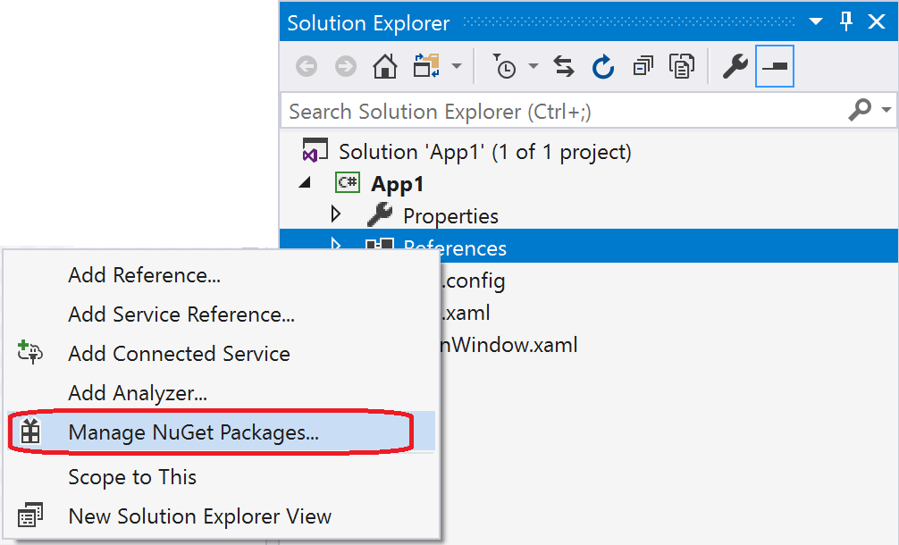
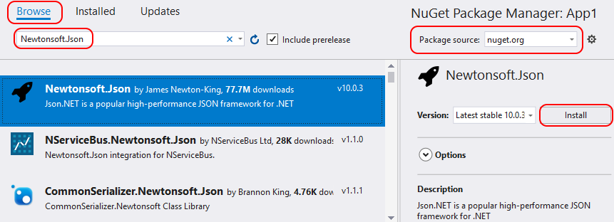
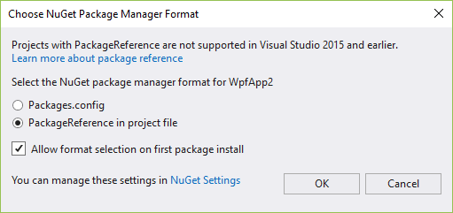
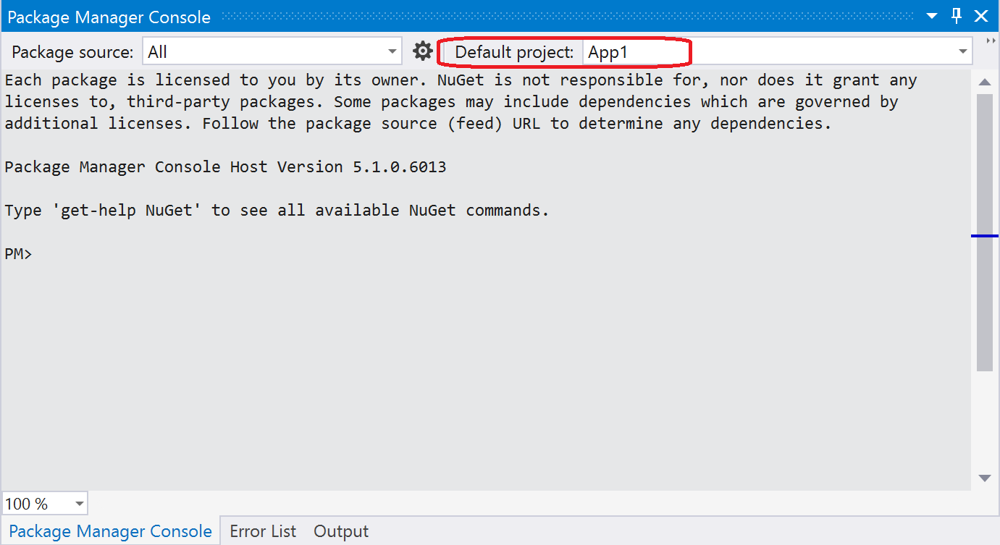
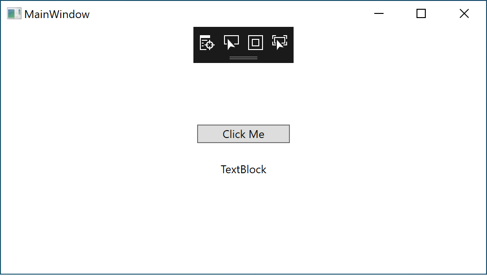
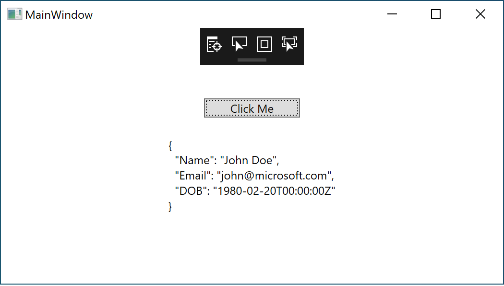

# Quickstart: Install and use a package in Visual Studio (Windows only)

NuGet packages contain reusable code that other developers make available to you for use in your projects. See [What is NuGet?](../What-is-NuGet.md) for background. Packages are installed into a Visual Studio project using the NuGet Package Manager, the [Package Manager Console](../consume-packages/install-use-packages-powershell.md), or the [dotnet CLI](install-and-use-a-package-using-the-dotnet-cli.md). This article demonstrates the process using the popular [Newtonsoft.Json](https://www.nuget.org/packages/Newtonsoft.Json/) package and a Windows Presentation Foundation (WPF) project. The same process applies to any other .NET or .NET Core project.

Once installed, refer to the package in code with `using <namespace>` where \<namespace\> is specific to the package you're using. Once the reference is made, you can call the package through its API.

> [!Tip]
> **Start with nuget.org**: Browsing *nuget.org* is how .NET developers typically find components they can reuse in their own applications. You can search *nuget.org* directly or find and install packages within Visual Studio as shown in this article. For general information, see [Find and evaluate NuGet packages](../consume-packages/finding-and-choosing-packages.md).

## Prerequisites

- Visual Studio 2019 with the .NET Desktop Development workload.

You can install the 2019 Community edition for free from [visualstudio.com](https://www.visualstudio.com/) or use the Professional or Enterprise editions.

If you're using Visual Studio for Mac, see [Install and use a package in Visual Studio for Mac](install-and-use-a-package-in-visual-studio-mac.md).

## Create a project

NuGet packages can be installed into any .NET project, provided that the package supports the same target framework as the project.

For this walkthrough, use a simple WPF app. Create a project in Visual Studio using **File** > **New Project**, typing **.NET** in the search box, and then selecting the **WPF App (.NET Framework)**. Click **Next**. Accept the default values for **Framework** when prompted.

Visual Studio creates the project, which can be found in Solution Explorer. For more information, see [Learn about Solution Explorer](/visualstudio/ide/use-solution-explorer).

## Add the Newtonsoft.Json NuGet package

To install the package, you can use either the NuGet Package Manager or the Package Manager Console. When you install a package, NuGet records the dependency in either your project file or a `packages.config` file (depending on the project format). For more information, see [Package consumption overview and workflow](../consume-packages/Overview-and-Workflow.md).

### NuGet Package Manager

1. In Solution Explorer, right-click **References** and choose **Manage NuGet Packages**.

    

1. Choose "nuget.org" as the **Package source**, select the **Browse** tab, search for **Newtonsoft.Json**, select that package in the list, and select **Install**:

    

    If you want more information on the NuGet Package Manager, see [Install and manage packages using Visual Studio](../consume-packages/install-use-packages-visual-studio.md).

1. Accept any license prompts.

1. (Visual Studio 2017 only) If prompted to select a package management format, select **PackageReference in project file**:

    

1. If prompted to review changes, select **OK**.

### Package Manager Console

1. Select the **Tools** > **NuGet Package Manager** > **Package Manager Console** menu command.

1. Once the console opens, check that the **Default project** drop-down list shows the project into which you want to install the package. If you have a single project in the solution, it is already selected.

    

1. Enter the command `Install-Package Newtonsoft.Json` (see [Install-Package](../reference/ps-reference/ps-ref-install-package.md)). The console window shows output for the command. Errors typically indicate that the package isn't compatible with the project's target framework.

   If you want more information on the Package Manager Console, see [Install and manage packages using Package Manager Console](../consume-packages/install-use-packages-powershell.md).

## Use the Newtonsoft.Json API in the app

With the Newtonsoft.Json package in the project, you can call its `JsonConvert.SerializeObject` method to convert an object to a human-readable string.

1. Open `MainWindow.xaml` and replace the existing `Grid` element with the following:

    ```xaml
    <Grid Background="White">
        <StackPanel VerticalAlignment="Center">
            <Button Click="Button_Click" Width="100px" HorizontalAlignment="Center" Content="Click Me" Margin="10"/>
            <TextBlock Name="TextBlock" HorizontalAlignment="Center" Text="TextBlock" Margin="10"/>
        </StackPanel>
    </Grid>
    ```

1. Open the `MainWindow.xaml.cs` file (located in Solution Explorer under the `MainWindow.xaml` node), and insert the following code inside the `MainWindow` class:

    ```cs
    public class Account
    {
        public string Name { get; set; }
        public string Email { get; set; }
        public DateTime DOB { get; set; }
    }

    private void Button_Click(object sender, RoutedEventArgs e)
    {
        Account account = new Account
        {
            Name = "John Doe",
            Email = "john@microsoft.com",
            DOB = new DateTime(1980, 2, 20, 0, 0, 0, DateTimeKind.Utc),
        };
        string json = JsonConvert.SerializeObject(account, Formatting.Indented);
        TextBlock.Text = json;
    }
    ```

1. Even though you added the Newtonsoft.Json package to the project, red squiggles appears under `JsonConvert` because you need a `using` statement at the top of the code file:

    ```cs
    using Newtonsoft.Json;
    ```

1. Build and run the app by pressing F5 or selecting **Debug** > **Start Debugging**:

    

1. Select on the button to see the contents of the TextBlock replaced with some JSON text:

    

## Related video

> [!Video https://docs.microsoft.com/shows/NuGet-101/Install-and-Use-a-NuGet-Package-with-Visual-Studio-2-of-5/player]

Find more NuGet videos on [Channel 9](/shows/NuGet-101/) and [YouTube](https://www.youtube.com/playlist?list=PLdo4fOcmZ0oVLvfkFk8O9h6v2Dcdh2bh_).

## Next steps

Congratulations on installing and using your first NuGet package!

> [!div class="nextstepaction"]
> [Install and manage packages using Visual Studio](../consume-packages/install-use-packages-visual-studio.md)

> [!div class="nextstepaction"]
> [Install and manage packages using Package Manager Console](../consume-packages/install-use-packages-powershell.md)

To explore more that NuGet has to offer, select the links below.

- [Overview and workflow of package consumption](../consume-packages/overview-and-workflow.md)
- [Finding and choosing packages](../consume-packages/finding-and-choosing-packages.md)
- [Package references in project files](../consume-packages/package-references-in-project-files.md)
