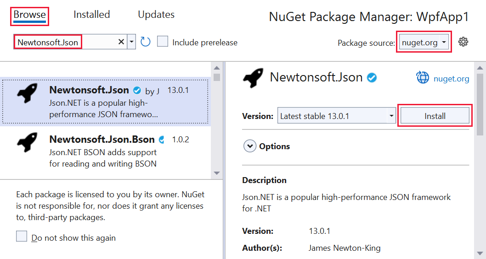
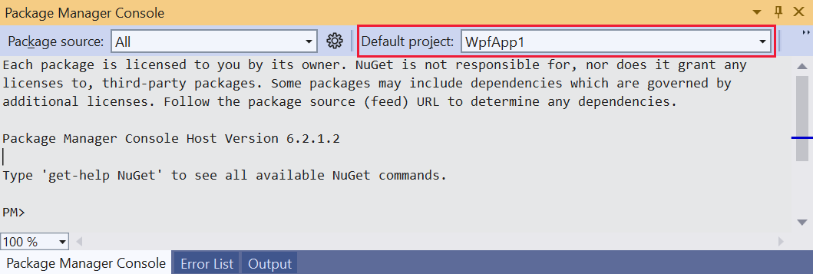
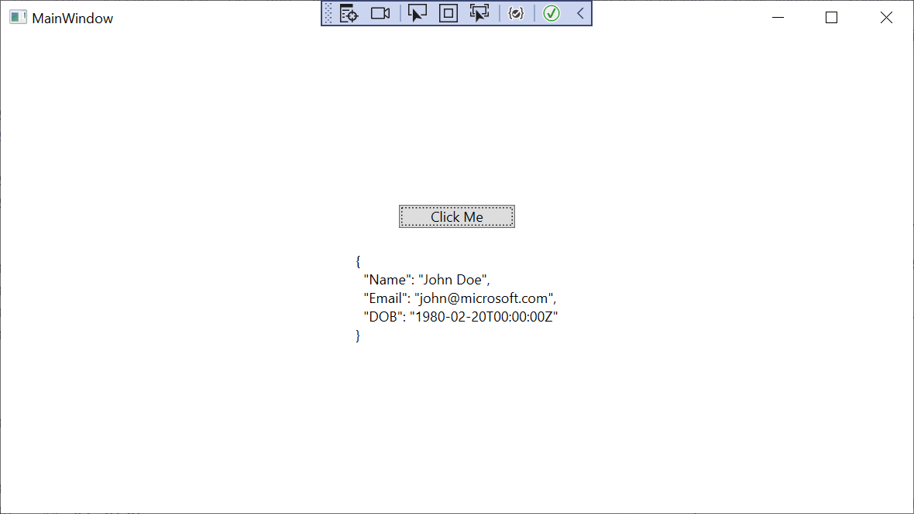

# Quickstart: Install and use a NuGet package in Visual Studio (Windows only)

*NuGet* packages contain Microsoft-supported reusable code that other developers have made available to you for use in your projects. You can install NuGet packages in a Microsoft Visual Studio project by using the NuGet Package Manager, the Package Manager Console, or the .NET CLI. This article demonstrates how to create a Windows Presentation Foundation (WPF) project with the popular `Newtonsoft.Json` package. The same process applies to any other .NET or .NET Core project.

After you install a package, you can then make a reference to it in your code with the `using <namespace>` statement, where \<namespace\> is the name of package you're using. After you've made a reference, you can then call the package through its API.

The article is for Windows users only. If you're using Visual Studio for Mac, see [Install and use a package in Visual Studio for Mac](install-and-use-a-package-in-visual-studio-mac.md).

> [!TIP]
> To find a NuGet package, start with *nuget.org*. Browsing for nuget.org is how .NET developers typically find components they can reuse in their own applications. You can do a search of nuget.org directly or find and install packages within Visual Studio as shown in this article. For more information, see [Find and evaluate NuGet packages](../consume-packages/finding-and-choosing-packages.md).

## Prerequisites

- Install Visual Studio 2022 for Windows with the .NET desktop development workload.

  You can install the 2022 Community edition for free from [visualstudio.microsoft.com](https://visualstudio.microsoft.com/), or use the Professional or Enterprise edition.

## Create a WPF project

You can install a NuGet package in any .NET project, if that package supports the same target framework as the project.

For this quickstart, create a WPF app project:

1. In Visual Studio, select **File** > **New** > **Project**.

1. Enter *.NET* in the search box, select **WPF App (.NET Framework)** for C#, and then select **Next**.

1. In the **Configure your new project** window, optionally update the **Project name** and the **Solution name**. Accept the default value for **Framework**, and then select **Create**.

   Visual Studio creates the project, and it appears in [Solution Explorer](/visualstudio/ide/use-solution-explorer).

## Add the Newtonsoft.Json NuGet package

To install a NuGet package, you can use either the NuGet Package Manager or the Package Manager Console. Depending on your project format, the installation of a NuGet package records the dependency in either your project file or a *packages.config* file. For more information, see [Package consumption workflow](../consume-packages/overview-and-workflow.md).

### NuGet Package Manager

To use the [NuGet Package Manager](../consume-packages/install-use-packages-visual-studio.md) to install the `Newtonsoft.Json` package in Visual Studio, follow these steps:

1. In **Solution Explorer**, right-click **References** and choose **Manage NuGet Packages**.

    

1. Choose **nuget.org** as the **Package source**.

1. From the **Browse** tab, search for *Newtonsoft.Json*, select **Newtonsoft.Json** in the list, and then select **Install**.

    

1. (Visual Studio 2017 only) If you're prompted to select a package management format, select **PackageReference in project file**:

    

1. If you're prompted to verify the installation, select **OK**.

### Package Manager Console

To use the [Package Manager Console](../consume-packages/install-use-packages-powershell.md) to install the `Newtonsoft.Json` package in Visual Studio, follow these steps:

1. From Visual Studio, select **Tools** > **NuGet Package Manager** > **Package Manager Console**.

1. After the **Package Manager Console** pane opens, verify that the **Default project** drop-down list shows the project in which you want to install the package. If you have a single project in the solution, it's already selected.

    

1. At the console prompt, enter the command `Install-Package Newtonsoft.Json`. For more information about this command, see [Install-Package](../reference/ps-reference/ps-ref-install-package.md).

   The console window the shows output for the command. Errors typically indicate that the package isn't compatible with the project's target framework.

## Use the Newtonsoft.Json API in the app

With the `Newtonsoft.Json` package in the project, call its `JsonConvert.SerializeObject` method to convert an object to a human-readable string:

1. From **Solution Explorer**, open *MainWindow.xaml* and replace the existing `<Grid>` element with the following code:

    ```xaml
    <Grid Background="White">
        <StackPanel VerticalAlignment="Center">
            <Button Click="Button_Click" Width="100px" HorizontalAlignment="Center" Content="Click Me" Margin="10"/>
            <TextBlock Name="TextBlock" HorizontalAlignment="Center" Text="TextBlock" Margin="10"/>
        </StackPanel>
    </Grid>
    ```

1. Open the *MainWindow.xaml.cs* file, under the *MainWindow.xaml* node, and insert the following code inside the `MainWindow` class:

    ```csharp
    public class Account
    {
        public string Name { get; set; }
        public string Email { get; set; }
        public DateTime DOB { get; set; }
    }

    private void Button_Click(object sender, RoutedEventArgs e)
    {
        Account account = new Account
        {
            Name = "John Doe",
            Email = "john@microsoft.com",
            DOB = new DateTime(1980, 2, 20, 0, 0, 0, DateTimeKind.Utc),
        };
        string json = JsonConvert.SerializeObject(account, Formatting.Indented);
        TextBlock.Text = json;
    }
    ```

1. To avoid an error for the `JsonConvert` object in the code (a red squiggle line will appear), add the following statement at the beginning of the code file:

    ```csharp
    using Newtonsoft.Json;
    ```

1. To build and run the app, press F5 or select **Debug** > **Start Debugging**.

   The following window appears:

    

1. Select the button to see the contents of the `TextBlock` object replaced with JSON text.

    

## Related video

- [Install and Use a NuGet Package with Visual Studio](/shows/nuget-101/install-and-use-a-nuget-package-with-visual-studio-2-of-5/player)
- Find more NuGet videos on [Channel 9](/shows/nuget-101/) and [YouTube](https://www.youtube.com/playlist?list=PLdo4fOcmZ0oVLvfkFk8O9h6v2Dcdh2bh_).

## See also

For more information about NuGet, see the following articles:

- [What is NuGet?](../what-is-nuget.md)
- [Package consumption workflow](../consume-packages/overview-and-workflow.md)
- [Find and choose packages](../consume-packages/finding-and-choosing-packages.md)
- [Package references in project files](../consume-packages/package-references-in-project-files.md)
- [Install and use a package using the .NET CLI](install-and-use-a-package-using-the-dotnet-cli.md).
- [Newtonsoft.Json package](https://www.nuget.org/packages/newtonsoft.json)

## Next steps

Congratulations on installing and using your first NuGet package. Advance to the next article to learn how to install and manage NuGet packages.

> [!div class="nextstepaction"]
> [Install and manage packages using using the NuGet Package Manager](../consume-packages/install-use-packages-visual-studio.md)

> [!div class="nextstepaction"]
> [Install and manage packages using the Package Manager Console](../consume-packages/install-use-packages-powershell.md)
