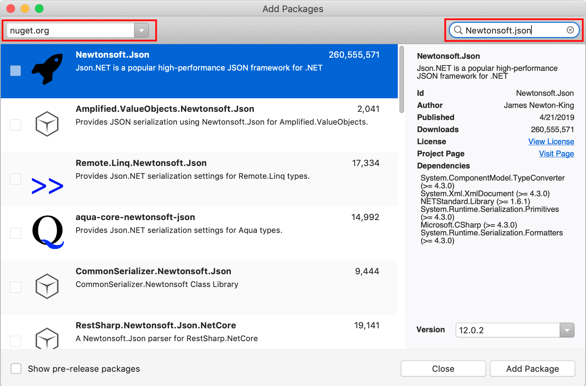
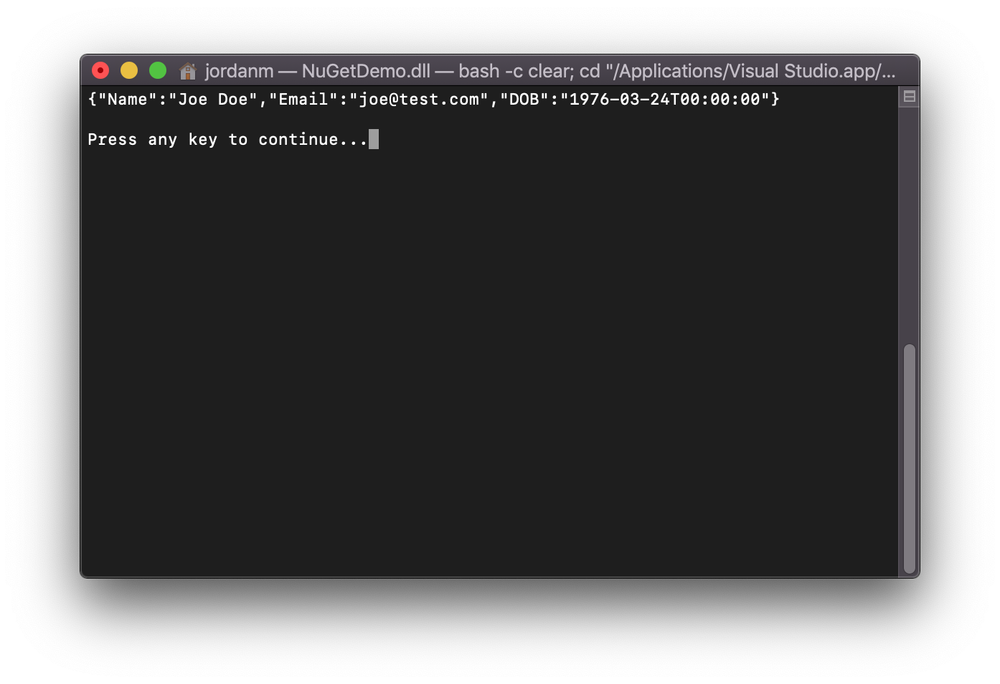

# Quickstart: Install and use a package

::: zone pivot="nugetexe"

> [!Warning]
> TODO: Recommend using dotnet CLI instead.

::: zone-end

::: zone pivot="dotnet"

NuGet packages contain reusable code that other developers make available to you for use in your projects. See [What is NuGet?](../What-is-NuGet.md) for background. Packages are installed into a .NET Core project using the `dotnet add package` command as described in this article for the popular [Newtonsoft.Json](https://www.nuget.org/packages/Newtonsoft.Json/) package.

Once installed, refer to the package in code with `using <namespace>` where \<namespace\> is specific to the package you're using. You can then use the package's API.

> [!Tip]
> **Start with nuget.org**: Browsing nuget.org is how .NET developers typically find components they can reuse in their own applications. You can search nuget.org directly or find and install packages within Visual Studio as shown in this article.

::: zone-end

::: zone pivot="nugetexe"

TODO

::: zone-end

::: zone pivot="vs"

It's a simple process to create a NuGet package from a .NET Standard Class Library in Visual Studio on Windows, and then publish it to nuget.org using a CLI tool.

::: zone-end

::: zone pivot="vs4mac"

NuGet packages contain reusable code that other developers make available to you for use in your projects. See [What is NuGet?](../What-is-NuGet.md) for background. Packages are installed into a Visual Studio for Mac project using the NuGet Package Manager. This article demonstrates the process using the popular [Newtonsoft.Json](https://www.nuget.org/packages/Newtonsoft.Json/) package and a .NET Core console project. The same process applies to any other Xamarin or .NET Core project.

Once installed, refer to the package in code with `using <namespace>` where \<namespace\> is specific to the package you're using. Once the reference is made, you can call the package through its API.

> [!Tip]
> **Start with nuget.org**: Browsing *nuget.org* is how .NET developers typically find components they can reuse in their own applications. You can search *nuget.org* directly or find and install packages within Visual Studio as shown in this article. For general information, see [Find and evaluate NuGet packages](../consume-packages/finding-and-choosing-packages.md).

::: zone-end

## Prerequisites

::: zone pivot="dotnet"

- The [.NET Core SDK](https://www.microsoft.com/net/download/), which provides the `dotnet` command-line tool. Starting in Visual Studio 2017, the dotnet CLI is automatically installed with any .NET Core related workloads.

::: zone-end

::: zone pivot="nugetexe"

TODO

::: zone-end

::: zone pivot="vs"

- Visual Studio 2019 with the .NET Desktop Development workload.

You can install the 2019 Community edition for free from [visualstudio.com](https://www.visualstudio.com/) or use the Professional or Enterprise editions.

::: zone-end

::: zone pivot="vs4mac"

- Visual Studio 2019 for Mac.

You can install the 2019 Community edition for free from [visualstudio.com](https://www.visualstudio.com/) or use the Professional or Enterprise editions.

::: zone-end

## Create a project

::: zone pivot="dotnet"

NuGet packages can be installed into a .NET project of some kind. For this walkthrough, create a simple .NET Core console project as follows:

1. Create a folder for the project.

1. Open a command prompt and switch to the new folder.

1. Create the project using the following command:

    ```dotnetcli
    dotnet new console
    ```

1. Use `dotnet run` to test that the app has been created properly.

::: end-zone

::: zone pivot="nugetexe"

TODO

::: end-zone

::: zone pivot="vs"

NuGet packages can be installed into any .NET project, provided that the package supports the same target framework as the project.

For this walkthrough, use a simple WPF app. Create a project in Visual Studio using **File** > **New Project**, typing **.NET** in the search box, and then selecting the **WPF App (.NET Framework)**. Click **Next**. Accept the default values for **Framework** when prompted.

Visual Studio creates the project, which opens in Solution Explorer.

::: end-zone

::: zone pivot="vs4mac"

NuGet packages can be installed into any .NET project, provided that the package supports the same target framework as the project.

For this walkthrough, use a simple .NET Core Console app. Create a project in Visual Studio for Mac using **File > New Solution...**, select the **.NET Core > App > Console Application** template. Click **Next**. Accept the default values for **Target Framework** when prompted.

Visual Studio creates the project, which opens in Solution Explorer.

::: end-zone

## Add the Newtonsoft.Json NuGet package

1. Use the following command to install the `Newtonsoft.json` package:

    ```dotnetcli
    dotnet add package Newtonsoft.Json
    ```

2. After the command completes, open the `.csproj` file to see the added reference:

    ```xml
   <ItemGroup>
    <PackageReference Include="Newtonsoft.Json" Version="12.0.1" />
   </ItemGroup>
    ```

## Use the Newtonsoft.Json API in the app

1. Open the `Program.cs` file and add the following line at the top of the file:

    ```cs
    using Newtonsoft.Json;
    ```

1. Add the following code before the `class Program` line:

    ```cs
    public class Account
    {
        public string Name { get; set; }
        public string Email { get; set; }
        public DateTime DOB { get; set; }
    }
    ```

1. Replace the `Main` function with the following:

    ```cs
    static void Main(string[] args)
    {
        Account account = new Account
        {
            Name = "John Doe",
            Email = "john@nuget.org",
            DOB = new DateTime(1980, 2, 20, 0, 0, 0, DateTimeKind.Utc),
        };

        string json = JsonConvert.SerializeObject(account, Formatting.Indented);
        Console.WriteLine(json);
    }
    ```

1. Build and run the app by using the `dotnet run` command. The output should be the JSON representation of the `Account` object in the code:

    ```output
    {
      "Name": "John Doe",
      "Email": "john@nuget.org",
      "DOB": "1980-02-20T00:00:00Z"
    }
    ```
## Related video

> [!Video https://channel9.msdn.com/Series/NuGet-101/Install-and-Use-a-NuGet-Package-with-the-NET-CLI-3-of-5/player]

Find more NuGet videos on [Channel 9](https://channel9.msdn.com/Series/NuGet-101) and [YouTube](https://www.youtube.com/playlist?list=PLdo4fOcmZ0oVLvfkFk8O9h6v2Dcdh2bh_).

## Next steps

Congratulations on installing and using your first NuGet package!

> [!div class="nextstepaction"]
> [Install and use packages using the dotnet CLI](../consume-packages/install-use-packages-dotnet-cli.md)

To explore more that NuGet has to offer, select the links below.

- [Overview and workflow of package consumption](../consume-packages/overview-and-workflow.md)
- [Finding and choosing packages](../consume-packages/finding-and-choosing-packages.md)
- [Package references in project files](../consume-packages/package-references-in-project-files.md)


::: zone pivot="dotnet"

# .NET CLI

TODO

::: zone-end

::: zone pivot="nugetexe"

# NuGet EXE CLI

TODO

::: zone-end

::: zone pivot="vs"

# Visual Studio

TODO

::: zone-end

::: zone pivot="vs4mac"

# Visual Studio for Mac

TODO

::: zone-end

# Quickstart: Install and use a package

NuGet packages contain reusable code that other developers make available to you for use in your projects. See [What is NuGet?](../What-is-NuGet.md) for background. Packages are installed into a Visual Studio for Mac project using the NuGet Package Manager. This article demonstrates the process using the popular [Newtonsoft.Json](https://www.nuget.org/packages/Newtonsoft.Json/) package and a .NET Core console project. The same process applies to any other Xamarin or .NET Core project.

Once installed, refer to the package in code with `using <namespace>` where \<namespace\> is specific to the package you're using. Once the reference is made, you can call the package through its API.

> [!Tip]
> **Start with nuget.org**: Browsing *nuget.org* is how .NET developers typically find components they can reuse in their own applications. You can search *nuget.org* directly or find and install packages within Visual Studio as shown in this article. For general information, see [Find and evaluate NuGet packages](../consume-packages/finding-and-choosing-packages.md).

## Prerequisites

- Visual Studio 2019 for Mac.

You can install the 2019 Community edition for free from [visualstudio.com](https://www.visualstudio.com/) or use the Professional or Enterprise editions.

If you're using Visual Studio on Windows, see [Install and use a package in Visual Studio (Windows Only)](install-and-use-a-package-in-visual-studio.md).

## Create a project

NuGet packages can be installed into any .NET project, provided that the package supports the same target framework as the project.

For this walkthrough, use a simple .NET Core Console app. Create a project in Visual Studio for Mac using **File > New Solution...**, select the **.NET Core > App > Console Application** template. Click **Next**. Accept the default values for **Target Framework** when prompted.

Visual Studio creates the project, which opens in Solution Explorer.

## Add the Newtonsoft.Json NuGet package

To install the package, you use the NuGet Package Manager. When you install a package, NuGet records the dependency in  either your project file or a `packages.config` file (depending on the project format). For more information, see [Package consumption overview and workflow](../consume-packages/Overview-and-Workflow.md).

### NuGet Package Manager

1. In Solution Explorer, right-click **Dependencies** and choose **Add Packages...**.

    

1. Choose "nuget.org" as the **Package source** in the top left corner of the dialog, and search for **Newtonsoft.Json**, select that package in the list, and select **Add Packages...**:

    

    If you want more information on the NuGet Package Manager, see [Install and manage packages using Visual Studio for Mac](../consume-packages/install-use-packages-visual-studio.md).

## Use the Newtonsoft.Json API in the app

With the Newtonsoft.Json package in the project, you can call its `JsonConvert.SerializeObject` method to convert an object to a human-readable string.

1. Open the `Program.cs` file (located in the Solution Pad) and replace the file contents with the following code:

    ```cs
    using System;
    using Newtonsoft.Json;

    namespace NuGetDemo
    {
        public class Account
        {
            public string Name { get; set; }
            public string Email { get; set; }
            public DateTime DOB { get; set; }
        }
    
        class Program
        {
            static void Main(string[] args)
            {
                Account account = new Account()
                {
                    Name = "Joe Doe",
                    Email = "joe@test.com",
                    DOB = new DateTime(1976, 3, 24)
                };
                string json = JsonConvert.SerializeObject(account);
                Console.WriteLine(json);
            }
        }
    }
    ```

1. Build and run the app by selecting **Run > Start Debugging**:

1. Once the app runs, you'll see the serialized JSON output appear in the console:

  

## Next steps
Congratulations on installing and using your first NuGet package!

> [!div class="nextstepaction"]
> [Install and manage packages using Visual Studio for Mac](/visualstudio/mac/nuget-walkthrough?toc=/nuget/toc.json)

To explore more that NuGet has to offer, select the links below.

- [Overview and workflow of package consumption](../consume-packages/overview-and-workflow.md)
- [Package references in project files](../consume-packages/package-references-in-project-files.md)
