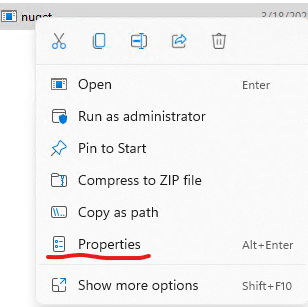
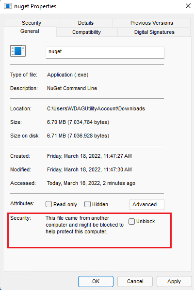

# NuGet Warning NU5133

## Example

<pre>Error NU5133: NuGet.exe file on path \Downloads\nuget.exe needs to be unblocked after downloading.</pre>

### Issue
Web browsers on Windows add "File Downloaded from the Internet" marking into any downloaded file, in this case `nuget.exe`, so Windows automatically flags it as coming from the Internet and potentially dangerous.
Therefore pack operation with `nuget.exe` may get blocked even though it's coming from reliable source such as 'nuget.org'.

### Solution
Right click on your downloaded copy of `nuget.exe` and select "Properties".

  

Now tick the `Unblock` then press apply.

  

Now try again the pack operation.
