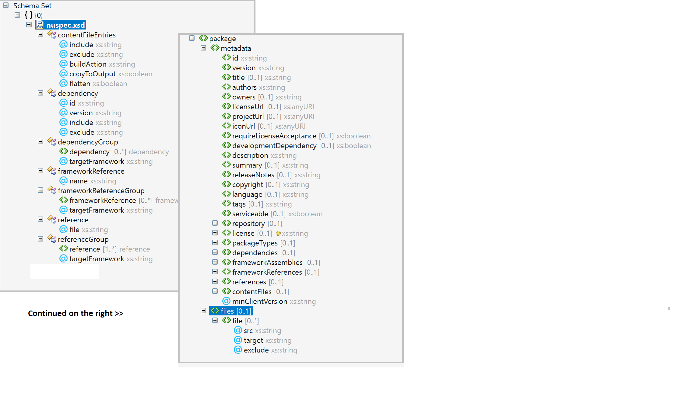

# .nuspec reference

A `.nuspec` file is an XML manifest that contains package metadata. This manifest is used both to build the package and to provide information to consumers. The manifest is always included in a package.

In this topic:

- [General form and schema](#general-form-and-schema)
- [Replacement tokens](#replacement-tokens) (when used with a Visual Studio project)
- [Dependencies](#dependencies)
- [Explicit assembly references](#explicit-assembly-references)
- [Framework assembly references](#framework-assembly-references)
- [Including assembly files](#including-assembly-files)
- [Including content files](#including-content-files)
- [Example nuspec files](#example-nuspec-files)

## Project type compatibility

- Use `.nuspec` with `nuget.exe pack` for non-SDK-style projects that use `packages.config`.

- A `.nuspec` file is not required to create packages for [SDK-style projects](../resources/check-project-format.md) (typically .NET Core and .NET Standard projects that use the [SDK attribute](/dotnet/core/tools/csproj#additions)). (Note that a `.nuspec` is generated when you create the package.)

   If you are creating a package using `dotnet.exe pack` or `msbuild pack target`, we recommend that you [include all the properties](../reference/msbuild-targets.md#pack-target) that are usually in the `.nuspec` file in the project file instead. However, you can instead choose to [use a `.nuspec` file to pack using `dotnet.exe` or `msbuild pack target`](../reference/msbuild-targets.md#packing-using-a-nuspec-file).

- For projects migrated from `packages.config` to [PackageReference](../consume-packages/package-references-in-project-files.md), a `.nuspec` file is not required to create the package. Instead, use [msbuild -t:pack](../consume-packages/migrate-packages-config-to-package-reference.md#create-a-package-after-migration).

## General form and schema

A `nuspec.xsd` schema file can be found in the [NuGet GitHub repository](https://github.com/NuGet/NuGet.Client/blob/dev/src/NuGet.Core/NuGet.Packaging/compiler/resources/nuspec.xsd).
Note, that this file only represents the most recent schema for a `.nuspec` file. 
No officially published versions exists and no version of that file corresponds to any specific NuGet version.  

Within this schema, a `.nuspec` file has the following general form:

```xml
<?xml version="1.0" encoding="utf-8"?>
<package xmlns="http://schemas.microsoft.com/packaging/2010/07/nuspec.xsd">
    <metadata>
        <!-- Required elements-->
        <id></id>
        <version></version>
        <description></description>
        <authors></authors>

        <!-- Optional elements -->
        <!-- ... -->
    </metadata>
    <!-- Optional 'files' node -->
</package>
```

For a clear visual representation of the schema, open the schema file in Visual Studio in Design mode and click on the **XML Schema Explorer** link. Alternately, open the file as code, right-click in the editor, and select **Show XML Schema Explorer**. Either way you get a view like the one below (when mostly expanded):



All XML element names in the .nuspec file are case-sensitive, as is the case for XML in general. For example, using the
metadata element `<description>` is correct and `<Description>` is not correct. The proper casing for each element name
is documented below.

> [!Important]
> While the `.nuspec` file contains a reference to a schema 
> (`xmlns="http://schemas.microsoft.com/packaging/2010/07/nuspec.xsd"`),
> The NuGet-Team has never published a schema file that could be used for automatic schema validation.

### Required metadata elements

Although the following elements are the minimum requirements for a package, you should consider adding the [optional metadata elements](#optional-metadata-elements) to improve the overall experience developers have with your package. 

These elements must appear within a `<metadata>` element.

#### id 
The case-insensitive package identifier, which must be unique across nuget.org or whatever gallery the package resides in. IDs may not contain spaces or characters that are not valid for a URL, and generally follow .NET namespace rules. See [Choosing a unique package identifier](../create-packages/creating-a-package.md#choose-a-unique-package-identifier-and-setting-the-version-number) for guidance.

When uploading a package to nuget.org, the `id` field is limited to 128 characters.

#### version
The version of the package, following the *major.minor.patch* pattern. Version numbers may include a pre-release suffix as described in [Package versioning](../concepts/package-versioning.md#pre-release-versions). 

When uploading a package to nuget.org, the `version` field is limited to 64 characters.

#### description
A description of the package for UI display.

When uploading a package to nuget.org, the `description` field is limited to 4000 characters.

#### authors
A comma-separated list of packages authors, matching the profile names on nuget.org. These are displayed in the NuGet Gallery on nuget.org and are used to cross-reference packages by the same authors. 

When uploading a package to nuget.org, the `authors` field is limited to 4000 characters.

### Optional metadata elements

#### owners
> [!Important]
> owners is deprecated. Use authors instead.

A comma-separated list of the package creators using profile names on nuget.org. This is often the same list as in `authors`, and is ignored when uploading the package to nuget.org. See [Managing package owners on nuget.org](../nuget-org/publish-a-package.md#managing-package-owners-on-nugetorg). 

#### projectUrl
A URL for the package's home page, often shown in UI displays as well as nuget.org. 

When uploading a package to nuget.org, the `projectUrl` field is limited to 4000 characters.

#### licenseUrl
> [!Important]
> licenseUrl is deprecated. Use license instead.

A URL for the package's license, often shown in UIs like nuget.org.

When uploading a package to nuget.org, the `licenseUrl` field is limited to 4000 characters.

#### license

*Supported with **NuGet 4.9.0** and above*

An SPDX license expression or path to a license file within the package, often shown in UIs like nuget.org.
If you're licensing the package under a common license, like MIT or BSD-2-Clause, use the associated [SPDX license identifier](https://spdx.org/licenses/). For example:

`<license type="expression">MIT</license>`

> [!Note]
> NuGet.org only accepts license expressions that are approved by the Open Source Initiative or the Free Software Foundation.

If your package is licensed under multiple common licenses, you can specify a composite license using the [SPDX expression syntax version 2.0](https://spdx.github.io/spdx-spec/v2-draft/SPDX-license-expressions/#d4-composite-license-expressions). For example:

`<license type="expression">BSD-2-Clause OR MIT</license>`

If you use a custom license that isn't supported by license expressions, you can package a `.txt` or `.md` file with the license's text. For example:

```xml
<package>
  <metadata>
    ...
    <license type="file">LICENSE.txt</license>
    ...
  </metadata>
  <files>
    ...
    <file src="licenses\LICENSE.txt" target="" />
    ...
  </files>
</package>
```

For the MSBuild equivalent, take a look at [Packing a license expression or a license file](msbuild-targets.md#packing-a-license-expression-or-a-license-file).

The exact syntax of NuGet's license expressions is described below in [ABNF](https://tools.ietf.org/html/rfc5234).

```cli
license-id            = <short form license identifier from https://spdx.org/spdx-specification-21-web-version#h.luq9dgcle9mo>

license-exception-id  = <short form license exception identifier from https://spdx.org/spdx-specification-21-web-version#h.ruv3yl8g6czd>

simple-expression = license-id / license-id”+”

compound-expression =  1*1(simple-expression /
                simple-expression "WITH" license-exception-id /
                compound-expression "AND" compound-expression /
                compound-expression "OR" compound-expression ) /                
                "(" compound-expression ")" )

license-expression =  1*1(simple-expression / compound-expression / UNLICENSED)
```

#### iconUrl

> [!Important]
> iconUrl is deprecated. Use icon instead.

A URL for a 128x128 image with transparency background to use as the icon for the package in UI display. Be sure this element contains the *direct image URL* and not the URL of a web page containing the image. For example, to use an image from GitHub, use the raw file URL like <em>https://github.com/\<username\>/\<repository\>/raw/\<branch\>/\<logo.png\></em>. 

When uploading a package to nuget.org, the `iconUrl` field is limited to 4000 characters.

#### icon

*Supported with **NuGet 5.3.0** and above*

It is a path to an image file within the package, often shown in UIs like nuget.org as the package icon. Image file size is limited to 1 MB. Supported file formats include JPEG and PNG. We recommend an image resolution of 128x128.

For example, you would add the following to your nuspec when creating a package using nuget.exe:

```xml
<package>
  <metadata>
    ...
    <icon>images\icon.png</icon>
    ...
  </metadata>
  <files>
    ...
    <file src="..\icon.png" target="images\" />
    ...
  </files>
</package>
```

[Package Icon nuspec sample.](https://github.com/NuGet/Samples/tree/main/PackageIconNuspecExample)

For the MSBuild equivalent, take a look at [Packing an icon image file](msbuild-targets.md#packing-an-icon-image-file).

> [!Tip]
> To maintain backward compatibility with clients and sources that don't yet support `icon`, specify both `icon` and `iconUrl`. Visual Studio supports `icon` for packages coming from a folder-based source.

#### readme

*Supported with **NuGet 5.10.0 preview 2** and above*

When packing a readme file, you need to use the `readme` element to specify the package path, relative to the root of the package. In addition to this, you need to make sure that the file is included in the package. Supported file formats include only Markdown (*.md*).

For example, you would add the following to your nuspec in order to pack a readme file with your project:

```xml
<package>
  <metadata>
    ...
    <readme>docs\readme.md</readme>
    ...
  </metadata>
  <files>
    ...
    <file src="..\readme.md" target="docs\" />
    ...
  </files>
</package>
```

For the MSBuild equivalent, take a look at [Packing a readme file](msbuild-targets.md#packagereadmefile). 

#### requireLicenseAcceptance
A Boolean value specifying whether the client must prompt the consumer to accept the package license before installing the package.

#### developmentDependency
*(2.8+)* A Boolean value specifying whether the package is be marked as a development-only-dependency, which prevents the package from being included as a dependency in other packages. With PackageReference (NuGet 4.8+), this flag also means that it will exclude compile-time assets from compilation. See [DevelopmentDependency support for PackageReference](https://github.com/NuGet/Home/wiki/DevelopmentDependency-support-for-PackageReference)

#### summary
> [!Important]
> `summary` is being deprecated. Use `description` instead.

A short description of the package for UI display. If omitted, a truncated version of `description` is used.

When uploading a package to nuget.org, the `summary` field is limited to 4000 characters.

#### releaseNotes
*(1.5+)* A description of the changes made in this release of the package, often used in UI like the **Updates** tab of the Visual Studio Package Manager in place of the package description.

When uploading a package to nuget.org, the `releaseNotes` field is limited to 35,000 characters.

#### copyright
*(1.5+)* Copyright details for the package.

When uploading a package to nuget.org, the `copyright` field is limited to 4000 characters.

#### language
The locale ID for the package. See [Creating localized packages](../create-packages/creating-localized-packages.md).

#### tags
A space-delimited list of tags and keywords that describe the package and aid discoverability of packages through search and filtering. 

When uploading a package to nuget.org, the `tags` field is limited to 4000 characters.

#### serviceable 
*(3.3+)* For internal NuGet use only.

#### repository
Repository metadata, consisting of four optional attributes: `type` and `url` *(4.0+)*, and `branch` and `commit` *(4.6+)*. These attributes allow you to map the `.nupkg` to the repository that built it, with the potential to get as detailed as the individual branch name and / or commit SHA-1 hash that built the package. This should be a publicly available url that can be invoked directly by a version control software. It should not be an html page as this is meant for the computer. For linking to project page, use the `projectUrl` field, instead.

For example:
```xml
<?xml version="1.0"?>
<package xmlns="http://schemas.microsoft.com/packaging/2010/07/nuspec.xsd">
    <metadata>
        ...
        <repository type="git" url="https://github.com/NuGet/NuGet.Client.git" branch="dev" commit="e1c65e4524cd70ee6e22abe33e6cb6ec73938cb3" />
        ...
    </metadata>
</package>
```

When uploading a package to nuget.org, the `type` attribute is limited to 100 characters and the `url` attribute is
limited to 4000 characters.

#### title
A human-friendly title of the package which may be used in some UI displays. (nuget.org and the Package Manager in Visual Studio do not show title)

When uploading a package to nuget.org, the `title` field is limited to 256 characters but is not used for any
display purposes.

#### Collection elements

#### packageTypes
*(3.5+)* A collection of zero or more `<packageType>` elements specifying the type of the package if other than a traditional dependency package. Each packageType has attributes of *name* and *version*. See [Setting a package type](../create-packages/set-package-type.md).

#### dependencies
A collection of zero or more `<dependency>` elements specifying the dependencies for the package. Each dependency has attributes of *id*, *version*, *include* (3.x+), and *exclude* (3.x+). See [Dependencies](#dependencies-element) below.

#### frameworkAssemblies
*(1.2+)* A collection of zero or more `<frameworkAssembly>` elements identifying .NET Framework assembly references that this package requires, which ensures that references are added to projects consuming the package. Each frameworkAssembly has *assemblyName* and *targetFramework* attributes. See [Specifying framework assembly references GAC](#specifying-framework-assembly-references-gac) below.

#### references
*(1.5+)* A collection of zero or more `<reference>` elements naming assemblies in the package's `lib` folder that are added as project references. Each reference has a *file* attribute. `<references>` can also contain a `<group>` element with a *targetFramework* attribute, that then contains `<reference>` elements. If omitted, all references in `lib` are included. See [Specifying explicit assembly references](#specifying-explicit-assembly-references) below.

#### contentFiles
*(3.3+)* A collection of `<files>` elements that identify content files to include in the consuming project. These files are specified with a set of attributes that describe how they should be used within the project system. See [Specifying files to include in the package](#specifying-files-to-include-in-the-package) below.

#### files 
The `<package>` node may contain a `<files>` node as a sibling to `<metadata>`, and a `<contentFiles>` child under `<metadata>`, to specify which assembly and content files to include in the package. See [Including assembly files](#including-assembly-files) and [Including content files](#including-content-files) later in this topic for details.

### metadata attributes

#### minClientVersion
Specifies the minimum version of the NuGet client that can install this package, enforced by nuget.exe and the Visual Studio Package Manager. This is used whenever the package depends on specific features of the `.nuspec` file that were added in a particular version of the NuGet client. For example, a package using the `developmentDependency` attribute should specify "2.8" for `minClientVersion`. Similarly, a package using the `contentFiles` element (see the next section) should set `minClientVersion` to "3.3". Note also that because NuGet clients prior to 2.5 do not recognize this flag, they *always* refuse to install the package no matter what `minClientVersion` contains.

```xml
<?xml version="1.0" encoding="utf-8"?>
<package xmlns="http://schemas.microsoft.com/packaging/2010/07/nuspec.xsd">
    <metadata minClientVersion="100.0.0.1">
        <id>dasdas</id>
        <version>2.0.0</version>
        <title />
        <authors>dsadas</authors>
        <owners />
        <requireLicenseAcceptance>false</requireLicenseAcceptance>
        <description>My package description.</description>
    </metadata>
    <files>
        <file src="content\one.txt" target="content\one.txt" />
    </files>
</package>
```

## Replacement tokens

When creating a package, the [`nuget pack` command](../reference/cli-reference/cli-ref-pack.md) replaces $-delimited tokens in the `.nuspec` file's `<metadata>` and `<files>` nodes with values that come from either a project file or the `pack` command's `-properties` switch.

On the command line, you specify token values with `nuget pack -properties <name>=<value>;<name>=<value>`. For example, you can use a token such as `$owners$` and `$desc$` in the `.nuspec` and provide the values at packing time as follows:

```ps
nuget pack MyProject.csproj -properties
    owners=janedoe,harikm,kimo,xiaop;desc="Awesome app logger utility"
```

To use values from a project, specify the tokens described in the table below (AssemblyInfo refers to the file in `Properties` such as `AssemblyInfo.cs` or `AssemblyInfo.vb`).

To use these tokens, run `nuget pack` with the project file rather than just the `.nuspec`. For example, when using the following command, the `$id$` and `$version$` tokens in a `.nuspec` file are replaced with the project's `AssemblyName` and `AssemblyVersion` values:

```ps
nuget pack MyProject.csproj
```

Typically, when you have a project, you create the `.nuspec` initially using `nuget spec MyProject.csproj` which automatically includes some of these standard tokens. However, if a project lacks values for required `.nuspec` elements, then `nuget pack` fails. Furthermore, if you change project values, be sure to rebuild before creating the package; this can be done conveniently with the pack command's `build` switch.

With the exception of `$configuration$`, values in the project are used in preference to any assigned to the same token on the command line.

| Token | Value source | Value
| --- | --- | ---
| **$id$** | Project file | AssemblyName (title) from the project file |
| **$version$** | AssemblyInfo | AssemblyInformationalVersion if present, otherwise AssemblyVersion |
| **$author$** | AssemblyInfo | AssemblyCompany |
| **$title$** | AssemblyInfo | AssemblyTitle |
| **$description$** | AssemblyInfo | AssemblyDescription |
| **$copyright$** | AssemblyInfo | AssemblyCopyright |
| **$configuration$** | Assembly DLL | Configuration used to build the assembly, defaulting to Debug. Note that to create a package using a Release configuration, you always use `-properties Configuration=Release` on the command line. |

Tokens can also be used to resolve paths when you include [assembly files](#including-assembly-files) and [content files](#including-content-files). The tokens have the same names as the MSBuild properties, making it possible to select files to be included depending on the current build configuration. For example, if you use the following tokens in the `.nuspec` file:

```xml
<files>
    <file src="bin\$configuration$\$id$.pdb" target="lib\net40" />
</files>
```

And you build an assembly whose `AssemblyName` is `LoggingLibrary` with the `Release` configuration in MSBuild, the resulting lines in the `.nuspec` file in the package is as follows:

```xml
<files>
    <file src="bin\Release\LoggingLibrary.pdb" target="lib\net40" />
</files>
```

## Dependencies element

The `<dependencies>` element within `<metadata>` contains any number of `<dependency>` elements that identify other packages upon which the top-level package depends. The attributes for each `<dependency>` are as follows:

| Attribute | Description |
| --- | --- |
| `id` | (Required) The package ID of the dependency, such as "EntityFramework" and "NUnit", which is the name of the package nuget.org shows on a package page. |
| `version` | (Required) The range of versions acceptable as a dependency. See [Package versioning](../concepts/package-versioning.md#version-ranges) for exact syntax. Floating versions are not supported. |
| include | A comma-delimited list of include/exclude tags (see below) indicating of the dependency to include in the final package. The default value is `all`. |
| exclude | A comma-delimited list of include/exclude tags (see below) indicating of the dependency to exclude in the final package. The  default value is `build,analyzers` which can be over-written. But `content/ ContentFiles` are also implicitly excluded in the final package which can't be over-written. Tags specified with `exclude` take precedence over those specified with `include`. For example, `include="runtime, compile" exclude="compile"` is the same as `include="runtime"`. |

When uploading a package to nuget.org, each dependency's `id` attribute is limited to 128 characters and the `version`
attribute is limited to 256 characters.

| Include/Exclude tag | Affected folders of the target |
| --- | --- |
| contentFiles | Content |
| runtime | Runtime, Resources, and FrameworkAssemblies |
| compile | lib |
| build | build (MSBuild props and targets) |
| native | native |
| none | No folders |
| all | All folders |

For example, the following lines indicate dependencies on `PackageA` version 1.1.0 or higher, and `PackageB` version 1.x.

```xml
<dependencies>
    <dependency id="PackageA" version="1.1.0" />
    <dependency id="PackageB" version="[1,2)" />
</dependencies>
```

The following lines indicate dependencies on the same packages, but specify to include the `contentFiles` and `build` folders of `PackageA` and everything but the `native` and `compile` folders of `PackageB`"

```xml
<dependencies>
    <dependency id="PackageA" version="1.1.0" include="contentFiles, build" />
    <dependency id="PackageB" version="[1,2)" exclude="native, compile" />
</dependencies>
```

> [!Important]
> When creating a `.nuspec` from a project using `nuget spec`, dependencies that exist in that project are not automatically included in the resulting `.nuspec` file. Instead, use `nuget pack myproject.csproj`, and get the *.nuspec* file from within the generated *.nupkg* file. This *.nuspec* contains the dependencies.

### Dependency groups

*Version 2.0+*

As an alternative to a single flat list, dependencies can be specified according to the framework profile of the target project using `<group>` elements within `<dependencies>`.

Each group has an attribute named `targetFramework` and contains zero or more `<dependency>` elements. Those dependencies are installed together when  the target framework is compatible with the project's framework profile.

The `<group>` element without a `targetFramework` attribute is used as the default or fallback list of dependencies. See [Target frameworks](../reference/target-frameworks.md) for the exact framework identifiers.

> [!Important]
> The group format cannot be intermixed with a flat list.

> [!Note]
> The format of [Target Framework Moniker (TFM)](../reference/target-frameworks.md) used in `lib/ref` folder is different when compared to the TFM used in `dependency groups`. If the target frameworks declared in the `dependencies group` and the `lib/ref` folder of `.nuspec` file do not have exact matches then `pack` command will raise [NuGet Warning NU5128](../reference/errors-and-warnings/nu5128.md).

The following example shows different variations of the `<group>` element:

```xml
<dependencies>
    <group>
        <dependency id="RouteMagic" version="1.1.0" />
    </group>

    <group targetFramework=".NETFramework4.7.2">
        <dependency id="jQuery" version="1.6.2" />
        <dependency id="WebActivator" version="1.4.4" />
    </group>

    <group targetFramework="netcoreapp3.1">
    </group>
</dependencies>
```

<a name="specifying-explicit-assembly-references"></a>

## Explicit assembly references

The `<references>` element is used by projects using `packages.config` to explicitly specify the assemblies that the target project should reference when using the package. Explicit references are typically used for design-time only assemblies. For more information, see the page on [selecting assemblies referenced by projects](../create-packages/select-assemblies-referenced-by-projects.md) for more information.

For example, the following `<references>` element instructs NuGet to add references to only `xunit.dll` and `xunit.extensions.dll` even if there are additional assemblies in the package:

```xml
<references>
    <reference file="xunit.dll" />
    <reference file="xunit.extensions.dll" />
</references>
```

### Reference groups

As an alternative to a single flat list, references can be specified according to the framework profile of the target project using `<group>` elements within `<references>`.

Each group has an attribute named `targetFramework` and contains zero or more `<reference>` elements. Those references are added to a project when the target framework is compatible with the project's framework profile.

The `<group>` element without a `targetFramework` attribute is used as the default or fallback list of references. See [Target frameworks](../reference/target-frameworks.md) for the exact framework identifiers.

> [!Important]
> The group format cannot be intermixed with a flat list.

The following example shows different variations of the `<group>` element:

```xml
<references>
    <group>
        <reference file="a.dll" />
    </group>

    <group targetFramework="net45">
        <reference file="b45.dll" />
    </group>

    <group targetFramework="netcore45">
        <reference file="bcore45.dll" />
    </group>
</references>
```

<a name="specifying-framework-assembly-references-gac"></a>

## Framework assembly references

Framework assemblies are those that are part of the .NET framework and should already be in the global assembly cache (GAC) for any given machine. By identifying those assemblies within the `<frameworkAssemblies>` element, a package can ensure that required references are added to a project in the event that the project doesn't have such references already. Such assemblies, of course, are not included in a package directly.

The `<frameworkAssemblies>` element contains zero or more `<frameworkAssembly>` elements, each of which specifies the following attributes:

| Attribute | Description |
| --- | --- |
| **assemblyName** | (Required) The fully qualified assembly name. |
| **targetFramework** | (Optional) Specifies the target framework to which this reference applies. If omitted, indicates that the reference applies to all frameworks. See [Target frameworks](../reference/target-frameworks.md) for the exact framework identifiers. |

The following example shows a reference to `System.Net` for all target frameworks, and a reference to `System.ServiceModel` for .NET Framework 4.0 only:

```xml
<frameworkAssemblies>
    <frameworkAssembly assemblyName="System.Net"  />

    <frameworkAssembly assemblyName="System.ServiceModel" targetFramework="net40" />
</frameworkAssemblies>
```

<a name="specifying-files-to-include-in-the-package"></a>

## Including assembly files

If you follow the conventions described in [Creating a Package](../create-packages/creating-a-package.md), you do not have to explicitly specify a list of files in the `.nuspec` file. The `nuget pack` command automatically picks up the necessary files.

> [!Important]
> When a package is installed into a project, NuGet automatically adds assembly references to the package's DLLs, *excluding* those that are named `.resources.dll` because they are assumed to be localized satellite assemblies. For this reason, avoid using `.resources.dll` for files that otherwise contain essential package code.

To bypass this automatic behavior and explicitly control which files are included in a package, place a `<files>` element as a child of `<package>` (and a sibling of `<metadata>`), identifying each file with a separate `<file>` element. For example:

```xml
<files>
    <file src="bin\Debug\*.dll" target="lib" />
    <file src="bin\Debug\*.pdb" target="lib" />
    <file src="tools\**\*.*" exclude="**\*.log" />
</files>
```

With NuGet 2.x and earlier, and projects using `packages.config`, the `<files>` element is also used to include immutable content files when a package is installed. With NuGet 3.3+ and projects PackageReference, the `<contentFiles>` element is used instead. See [Including content files](#including-content-files) below for details.

### File element attributes

Each `<file>` element specifies the following attributes:

| Attribute | Description |
| --- | --- |
| **src** | The location of the file or files to include, subject to exclusions specified by the `exclude` attribute. The path is relative to the `.nuspec` file unless an absolute path is specified. The wildcard character `*` is allowed, and the double wildcard `**` implies a recursive folder search. |
| **target** | The relative path to the folder within the package where the source files are placed, which must begin with `lib`, `content`, `build`, or `tools`. See [Creating a .nuspec from a convention-based working directory](../create-packages/creating-a-package.md#from-a-convention-based-working-directory). |
| **exclude** | A semicolon-delimited list of files or file patterns to exclude from the `src` location. The wildcard character `*` is allowed, and the double wildcard `**` implies a recursive folder search. |

### Examples

**Single assembly**

```
Source file:
    library.dll

.nuspec entry:
    <file src="library.dll" target="lib" />

Packaged result:
    lib\library.dll
```

**Single assembly specific to a target framework**

```
Source file:
    library.dll

.nuspec entry:
    <file src="assemblies\net40\library.dll" target="lib\net40" />

Packaged result:
    lib\net40\library.dll
```

**Set of DLLs using a wildcard**

```
Source files:
    bin\release\libraryA.dll
    bin\release\libraryB.dll

.nuspec entry:
    <file src="bin\release\*.dll" target="lib" />

Packaged result:
    lib\libraryA.dll
    lib\libraryB.dll
```

**DLLs for different frameworks**

```
Source files:
    lib\net40\library.dll
    lib\net20\library.dll

.nuspec entry (using ** recursive search):
    <file src="lib\**" target="lib" />

Packaged result:
    lib\net40\library.dll
    lib\net20\library.dll
```

**Excluding files**

```
Source files:
    \tools\fileA.bak
    \tools\fileB.bak
    \tools\fileA.log
    \tools\build\fileB.log

.nuspec entries:
    <file src="tools\*.*" target="tools" exclude="tools\*.bak" />
    <file src="tools\**\*.*" target="tools" exclude="**\*.log" />

Package result:
    (no files)
```

## Including content files

Content files are immutable files that a package needs to include in a project. Being immutable, they are not intended to be modified by the consuming project. Example content files include:

- Images that are embedded as resources
- Source files that are already compiled
- Scripts that need to be included with the build output of the project
- Configuration files for the package that need to be included in the project but don't need any project-specific changes

Content files are included in a package using the `<files>` element, specifying the `content` folder in the `target` attribute. However, such files are ignored when the package is installed in a project using PackageReference, which instead uses the `<contentFiles>` element.

For maximum compatibility with consuming projects, a package ideally specifies the content files in both elements.

### Using the files element for content files

For content files, simply use the same format as for assembly files, but specify `content` as the base folder in the `target` attribute as shown in the following examples.

**Basic content files**

```
Source files:
    css\mobile\style1.css
    css\mobile\style2.css

.nuspec entry:
    <file src="css\mobile\*.css" target="content\css\mobile" />

Packaged result:
    content\css\mobile\style1.css
    content\css\mobile\style2.css
```

**Content files with directory structure**

```
Source files:
    css\mobile\style.css
    css\mobile\wp7\style.css
    css\browser\style.css

.nuspec entry:
    <file src="css\**\*.css" target="content\css" />

Packaged result:
    content\css\mobile\style.css
    content\css\mobile\wp7\style.css
    content\css\browser\style.css
```

**Content file specific to a target framework**

```
Source file:
    css\cool\style.css

.nuspec entry
    <file src="css\cool\style.css" target="Content" />

Packaged result:
    content\style.css
```

**Content file copied to a folder with dot in name**

In this case, NuGet sees that the extension in `target` does not match the extension in `src` and thus treats that part of the name in `target` as a folder:

```
Source file:
    images\picture.png

.nuspec entry:
    <file src="images\picture.png" target="Content\images\package.icons" />

Packaged result:
    content\images\package.icons\picture.png
```

**Content files without extensions**

To include files without an extension, use the `*` or `**` wildcards:

```
Source file:
    flags\installed

.nuspec entry:
    <file src="flags\**" target="flags" />

Packaged result:
    flags\installed
```

**Content files with deep path and deep target**

In this case, because the file extensions of the source and target match, NuGet assumes that the target is a file name and not a folder:

```
Source file:
    css\cool\style.css

.nuspec entry:
    <file src="css\cool\style.css" target="Content\css\cool" />
    or:
    <file src="css\cool\style.css" target="Content\css\cool\style.css" />

Packaged result:
    content\css\cool\style.css
```

**Renaming a content file in the package**

```
Source file:
    ie\css\style.css

.nuspec entry:
    <file src="ie\css\style.css" target="Content\css\ie.css" />

Packaged result:
    content\css\ie.css
```

**Excluding files**

```
Source file:
    docs\*.txt (multiple files)

.nuspec entry:
    <file src="docs\*.txt" target="content\docs" exclude="docs\admin.txt" />
    or
    <file src="*.txt" target="content\docs" exclude="admin.txt;log.txt" />

Packaged result:
    All .txt files from docs except admin.txt (first example)
    All .txt files from docs except admin.txt and log.txt (second example)
```

<a name="using-contentfiles-element-for-content-files"></a>

### Using the contentFiles element for content files

*NuGet 4.0+ with PackageReference*

By default, a package places content in a `contentFiles` folder (see below) and `nuget pack` included all files in that folder using default attributes. In this case it's not necessary to include a `contentFiles` node in the `.nuspec` at all.

To control which files are included, the `<contentFiles>` element specifies is a collection of `<files>` elements that identify the exact files include.

These files are specified with a set of attributes that describe how they should be used within the project system:

| Attribute | Description |
| --- | --- |
| **include** | (Required) The location of the file or files to include, subject to exclusions specified by the `exclude` attribute. The path is relative to the `contentFiles` folder unless an absolute path is specified. The wildcard character `*` is allowed, and the double wildcard `**` implies a recursive folder search. |
| **exclude** | A semicolon-delimited list of files or file patterns to exclude from the `src` location. The wildcard character `*` is allowed, and the double wildcard `**` implies a recursive folder search. |
| **buildAction** | The build action to assign to the content item for MSBuild, such as `Content`, `None`, `Embedded Resource`, `Compile`, etc. The default is `Compile`. |
| **copyToOutput** | A Boolean indicating whether to copy content items to the build (or publish) output folder. The default is false. |
| **flatten** | A Boolean indicating whether to copy content items to a single folder in the build output (true), or to preserve the folder structure in the package (false). This flag only works when copyToOutput flag is set to true. The default is false. |

When installing a package, NuGet applies the child elements of `<contentFiles>` from top to bottom. If multiple entries match the same file then all entries are applied. The top-most entry overrides the lower entries if there is a conflict for the same attribute.

#### Package folder structure

The package project should structure content using the following pattern:

```
/contentFiles/{codeLanguage}/{TxM}/{any?}
```

- `codeLanguages` may be `cs`, `vb`, `fs`, `any`, or the lowercase equivalent of a given `$(ProjectLanguage)`
- `TxM` is any legal target framework moniker that NuGet supports (see [Target frameworks](../reference/target-frameworks.md)).
- Any folder structure may be appended to the end of this syntax.

For example:

```
Language- and framework-agnostic:
    /contentFiles/any/any/config.xml

net45 content for all languages
    /contentFiles/any/net45/config.xml

C#-specific content for net45 and up
    /contentFiles/cs/net45/sample.cs
```

Empty folders can use `.` to opt out of providing content for certain combinations of language and TxM, for example:

```
/contentFiles/vb/any/code.vb
/contentFiles/cs/any/.
```

#### Example contentFiles section

```xml
<?xml version="1.0" encoding="utf-8"?>
<package xmlns="http://schemas.microsoft.com/packaging/2010/07/nuspec.xsd">
    <metadata>
        ...
        <contentFiles>
            <!-- Embed image resources -->
            <files include="any/any/images/dnf.png" buildAction="EmbeddedResource" />
            <files include="any/any/images/ui.png" buildAction="EmbeddedResource" />

            <!-- Embed all image resources under contentFiles/cs/ -->
            <files include="cs/**/*.png" buildAction="EmbeddedResource" />

            <!-- Copy config.xml to the root of the output folder -->
            <files include="cs/uap/config/config.xml" buildAction="None" copyToOutput="true" flatten="true" />

            <!-- Copy run.cmd to the output folder and keep the directory structure -->
            <files include="cs/commands/run.cmd" buildAction="None" copyToOutput="true" flatten="false" />

            <!-- Include everything in the scripts folder except exe files -->
            <files include="cs/net45/scripts/*" exclude="**/*.exe"  buildAction="None" copyToOutput="true" />
        </contentFiles>
        </metadata>
</package>
```

## Framework reference groups

*Version 5.1+ wih PackageReference only*

Framework References are a .NET Core concept representing shared frameworks such as WPF or Windows Forms.
By specifying a shared framework, the package ensures that all its framework dependencies are included in the referencing project.

Each `<group>` element requires a `targetFramework` attribute and zero or more `<frameworkReference>` elements.

The following example shows a nuspec generated for a .NET Core WPF project.
Note that hand authoring nuspecs that contain framework references is not recommended. Consider using the [targets](msbuild-targets.md) pack instead, which will automatically infer them from the project.

```xml
<package xmlns="http://schemas.microsoft.com/packaging/2012/06/nuspec.xsd">
  <metadata>
    <dependencies>
      <group targetFramework=".NETCoreApp3.1" />
    </dependencies>
    <frameworkReferences>
      <group targetFramework=".NETCoreApp3.1">
        <frameworkReference name="Microsoft.WindowsDesktop.App.WPF" />
      </group>
    </frameworkReferences>
  </metadata>
</package>
```

## Example nuspec files

**A simple `.nuspec` that does not specify dependencies or files**

```xml
<?xml version="1.0" encoding="utf-8"?>
<package xmlns="http://schemas.microsoft.com/packaging/2010/07/nuspec.xsd">
    <metadata>
        <id>sample</id>
        <version>1.2.3</version>
        <authors>Kim Abercrombie, Franck Halmaert</authors>
        <description>Sample exists only to show a sample .nuspec file.</description>
        <language>en-US</language>
        <projectUrl>http://xunit.codeplex.com/</projectUrl>
        <license type="expression">MIT</license>
    </metadata>
</package>
```

**A `.nuspec` with dependencies**

```xml
<?xml version="1.0" encoding="utf-8"?>
<package xmlns="http://schemas.microsoft.com/packaging/2010/07/nuspec.xsd">
    <metadata>
        <id>sample</id>
        <version>1.0.0</version>
        <authors>Microsoft</authors>
        <dependencies>
            <dependency id="another-package" version="3.0.0" />
            <dependency id="yet-another-package" version="1.0.0" />
        </dependencies>
    </metadata>
</package>
```

**A `.nuspec` with files**

```xml
<?xml version="1.0"?>
<package xmlns="http://schemas.microsoft.com/packaging/2010/07/nuspec.xsd">
    <metadata>
        <id>routedebugger</id>
        <version>1.0.0</version>
        <authors>Jay Hamlin</authors>
        <requireLicenseAcceptance>false</requireLicenseAcceptance>
        <description>Route Debugger is a little utility I wrote...</description>
    </metadata>
    <files>
        <file src="bin\Debug\*.dll" target="lib" />
    </files>
</package>
```

**A `.nuspec` with framework assemblies**

```xml
<?xml version="1.0"?>
<package xmlns="http://schemas.microsoft.com/packaging/2010/07/nuspec.xsd">
    <metadata>
        <id>PackageWithGacReferences</id>
        <version>1.0</version>
        <authors>Author here</authors>
        <requireLicenseAcceptance>false</requireLicenseAcceptance>
        <description>
            A package that has framework assemblyReferences depending
            on the target framework.
        </description>
        <frameworkAssemblies>
            <frameworkAssembly assemblyName="System.Web" targetFramework="net40" />
            <frameworkAssembly assemblyName="System.Net" targetFramework="net40-client, net40" />
            <frameworkAssembly assemblyName="Microsoft.Devices.Sensors" targetFramework="sl4-wp" />
            <frameworkAssembly assemblyName="System.Json" targetFramework="sl3" />
        </frameworkAssemblies>
    </metadata>
</package>
```

In this example, the following are installed for specific project targets:

- .NET4 -> `System.Web`, `System.Net`
- .NET4 Client Profile -> `System.Net`
- Silverlight 3 -> `System.Json`
- WindowsPhone -> `Microsoft.Devices.Sensors`
