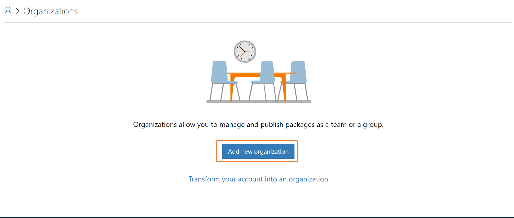
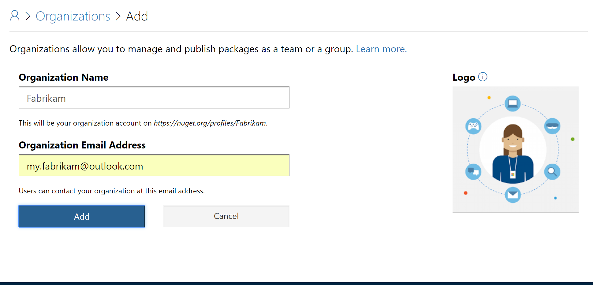
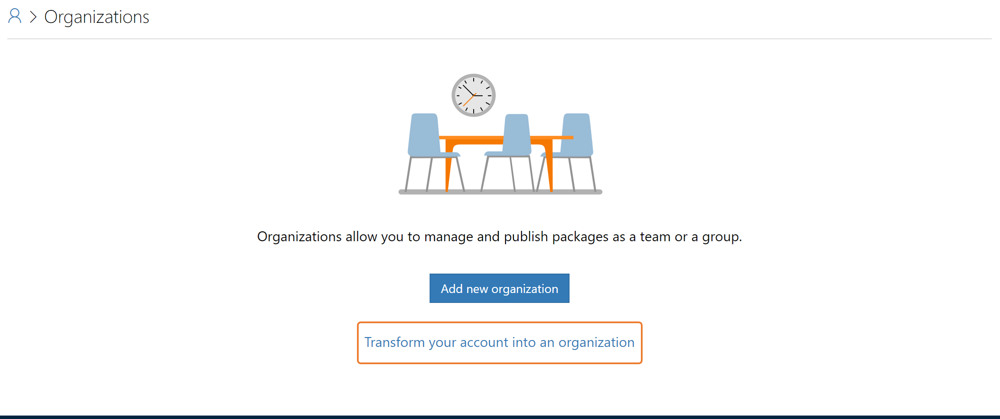
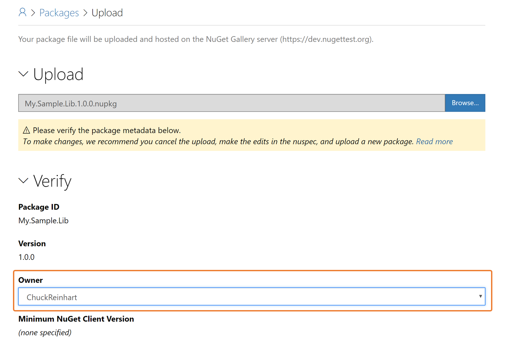
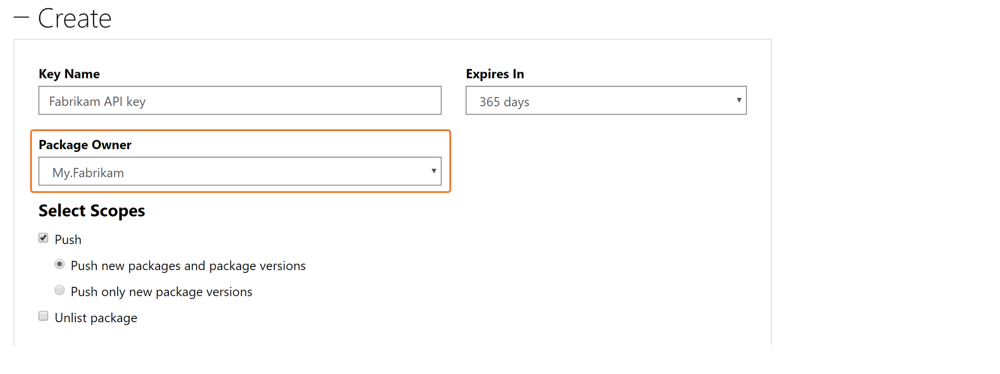
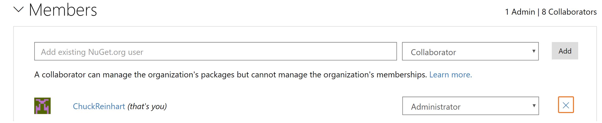

Organizations enables businesses and open-source projects to collaborate across many packages at once using a single NuGet.org identity. For a package consumer, an organization account appears same as an existing user account on NuGet.org. 

## User accounts vs. Organization accounts
Your user account is your identity on NuGet.org. Your user account can be a member of any number of organizations. A package can belong to an organization account the same way it could belong to a user account. Package consumers do not see any difference between an user account or the organization account. Both appear as package `owners`.

An organization account would have one or more user accounts as its members. These members can manage a set of packages while maintining a single identity ownership. 

## Adding a new Organization

To add a new Organization, go to **Manage Organizations**... 

.. and click on **Add new organization**

On the add new organization page, provide the organization name and email address. Organization accounts share the same namespace as accounts and hence you would require to key in a name that is not already an existing account on NuGet.org. Similarly the email address has to be unique one thats not already been used.

Once the Organization account is created, you are the Administrator and you can add more members and submit packages against it.

### Transform existing account to an Organization
If you were managing your packages as a team using a single user account and would like to convert the user account into an organization, you can do so through the **Transform your account to an organization** option:

This will bring up the transform page that requires you to provide a user account who would be the Administrator to the newly transformed organization. Please be aware that this is an irreversible process i.e. you cannot transform back to a user account from an organization account you transformed to.

## Managing Organizations 

### Adding members
As the Organization Administrator, you can add more members to it. You would need to provide the NuGet.org's **user account names** to add them as members. You **cannot** add members through their email addresses.

While adding members, you cwould need to select one of the following membership roles:

### Collaborator
A colloborator can manage all the organization's packages. He/She can submit new packages, update or unlist existing packages. A collaborator, however, cannot make changes to the organization i.e. a collaborator cannot modify the email address, change notification settings or add/remove members to the organization. A collaborator can also not request or act on co-ownership requests for the organization's packages. 

### Administrator
An administrator has absolute permissions on the organization and its packages. Like a collaborator, he/she can manage all the organization's packages - submit new packages, update or unlist existing packages. In addition he/she can also make changes to the organization metadata and memberships. An administrator can also request or act on co-ownership requests for the organization's packages.

## Managing packages
As an organization member, you can see all the organization's packages in the `Packages` section of the Organization's details page. You can also view all your packages across your account and all organizations you are member of, on the `Manage Packages` page. You can select the account filter to view packages by your account or any specific organization.

## Publishing packages
You can publish packages to an organzation in the same ways you can publish packages to your account i.e. either by directly uploading the NuGet package or by pushing the package through CLI.

### Uploading packages
When you directly upload a new package on the [Upload](https://www.nuget.org/packages/manage/upload) page, you can select the account (your account) or organization it should be uploaded for:

For submitting any update to an existing package, you would not see this account/organization dropdown as the package ownership is already known to NuGet.org.

### Using API keys
To [push a package through CLI](https://docs.microsoft.com/en-us/nuget/create-packages/publish-a-package#command-line), you would need to get an API key that needs to be used with the [`push` command](https://docs.microsoft.com/en-us/nuget/tools/cli-ref-push). 

While creating a new API key, please select the organization for which you need this API key for. Any API key you create would be only applicable to this organization that you choose here:

## Removing Organization
You can remove yourself from an organization by clicking on the `X` button against your membership:

If you are an Administrator, you can remove any other member including another Administrator from the organization. If you are the sole Administrator for an Organization, you cannot remove yourself unless you add another member as an Organization administrator.

If you wish to delete an organization, you can do so:
* If you are the sole member (Administrator) of the organization.
* If your organization does not own any package.

If the above conditions are satisfied, you can request deletion of the organization. 

