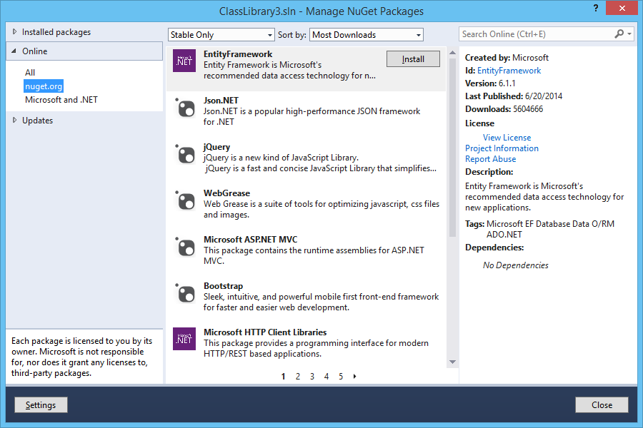
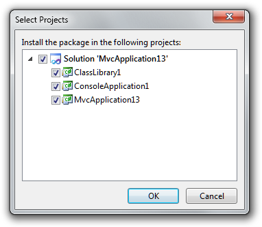
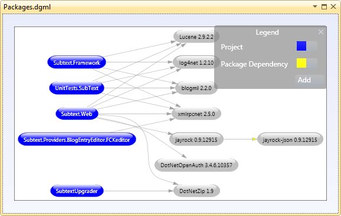
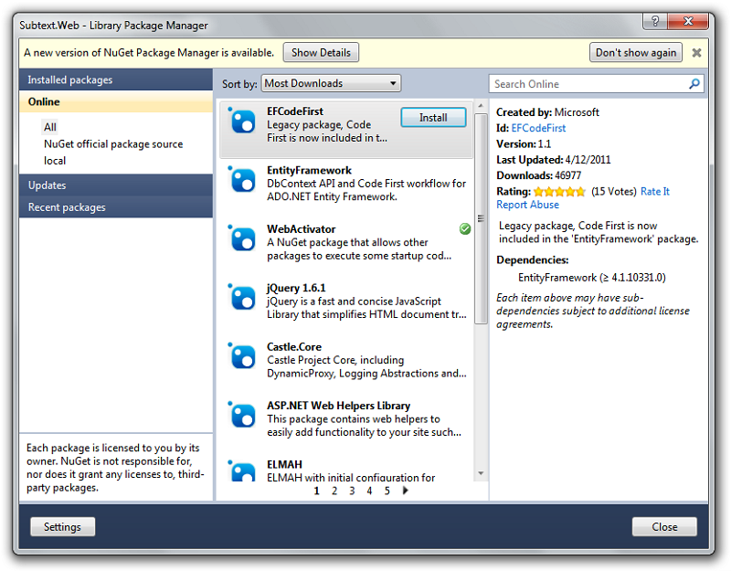
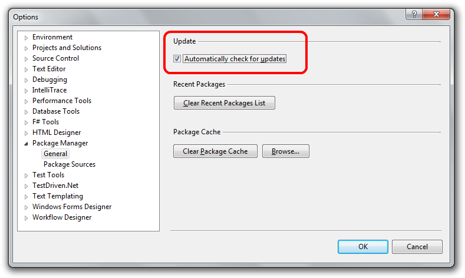

# NuGet 1.4 Release Notes

[NuGet 1.3 Release Notes](../release-notes/nuget-1.3.md) | [NuGet 1.5 Release Notes](../release-notes/nuget-1.5.md)

NuGet 1.4 was released on June 17, 2011.

## Features

### Update-Package improvements
NuGet 1.4 introduces a lot of improvements to the Update-Package command making it easier to keep packages at the same
version across multiple projects in a solution. For example, when upgrading a package to the latest version, it's very
common to want all projects with that package installed to be updated to the same verision.

The `Update-Package` command now makes it easier to:

#### Update all packages in a single project

```
Update-Package -Project MvcApplication1
```

#### Update a package in all projects

```
Update-Package PackageId
```

#### Update all packages in all projects

```
Update-Package
```

#### Perform a "safe" update on all packages
The `-Safe` flag constrains upgrades to only versions with the same Major and Minor version component. For example,
if version 1.0.0 of a package is installed, and versions 1.0.1, 1.0.2, and 1.1 are available in the feed, the `-Safe`
flag updates the package to 1.0.2. Upgrading without the `-Safe` flag would upgrade the package to the latest version,
1.1.

```
Update-Package -Safe
```

### Managing Packages at the Solution Level
Prior to NuGet 1.4, installing a package into multiple projects was cumbersome using the dialog. It required launching
the dialog once per project.

NuGet 1.4 adds support for installing/uninstalling/updating packages in multiple projects at the same time. Simply launch
the by right clicking the Solution and selecting the **Manage NuGet Packages** menu option.



Notice that in the title bar of the dialog, the name of the solution is displayed, not the name of a project.
Package operations now provide a list of checkboxes with the list of projects the operation should apply to.



For more details, see the topic on [Managing Packages for the Solution](../consume-packages/install-use-packages-visual-studio.md#manage-packages-for-the-solution).

### Constraining Upgrades To Allowed Versions
By default, when running the `Update-Package` command on a package (or updating the package using dialog), it will be
updated to the latest version in the feed. With the new support for updating all packages, there may be cases in which
you want to lock a package to a specific version range. For example, you may know in advance that your application will
only work with version 2.* of a package, but not 3.0 and above. In order to prevent accidentally updating the package to
3, NuGet 1.4 adds support for constraining the range of versions that packages can be upgraded to by hand editing the
`packages.config` file using the new `allowedVersions` attribute.

For example, the following example shows how to lock the `SomePackage` package the version range 2.0 - 3.0 (exclusive).
The `allowedVersions` attribute accepts values using the [version range format](../concepts/package-versioning.md#version-ranges).

```xml
<?xml version="1.0" encoding="utf-8"?>
<packages>
    <package id="SomePackage" version="2.1.0" allowedVersions="[2.0, 3.0)" />
</packages>
```

Note that in 1.4, locking a package to a specific version range must be hand-edited. In NuGet 1.5 we plan to add support for placing this
range via the `Install-Package` command.

### Package Visualizer
The new package visualizer, launched via the **Tools** -> **Library Package Manager** -> **Package Visualizer**
menu option, enables you to easily visualize all the projects and their package dependencies within a solution.

_**Important Note:** This feature takes advantage of the DGML support in Visual Studio. Creating the visualization is only
supported in Visual Studio Ultimate. Viewing a DGML diagram is only supported in Visual Studio Premium or Higher._



### Automatic Update Check for the NuGet Dialog
Some versions of NuGet introduce new features expressed via the `.nuspec` file which are not understood by older versions of the NuGet dialog.
One example is the introduction in NuGet 1.4 for [specifying framework assemblies](../release-notes/nuget-1.2.md#framework-assembly-refs).
Because of this, it's important to use the latest version of NuGet to ensure you can use packages taking advantage of the latest features.
To make updates to NuGet more visible, the NuGet dialog contains logic to highlight when a newer version is available.

_**Note**: The check is only made if the **Online** tab has been selected in the current session._



To turn off the automatic check for updates, go to the NuGet settings dialog and uncheck
**Automatically check for updates**.



This feature was actually added in NuGet 1.3, but would not be visible, of course, until an update to 1.3, such as
NuGet 1.4, was made available.

### Package Manager Dialog Improvements
* **Menu names improved**: Menu options to launch the dialog have been renamed for clarity. The menu option is now **Manage NuGet Packages**.
* **Details pane shows latest update date**: The NuGet dialog displays the date of the latest update in the details pane for a package when
the **Online** or **Updates** tab is selected.
* **List of tags displayed**: The Nuget dialog displays tags.

### Powershell Improvements
* **Signed PowerShell scripts**: NuGet includes signed Powershell scripts enabling usage in more restrictive environments.
* **Prompting Support**: The Package Manager Console now supports prompting via the `$host.ui.Prompt` and `$host.ui.PromptForChoice`
commands.
* **Package Source Names**: Supplying the name of a package source is supported when specifying a package source using the `-Source` flag.

### nuget.exe Command line improvements
* **NuGet Custom Commands**: nuget.exe is extensible via custom commands using MEF.
* **Simpler the workflow for creating symbol packages**: The `-Symbols` flag can be applied to a normal convention
based folder structure creating a symbols package by only including the source and `.pdb` files within the folder.
* **Specifying Multiple Sources**: The `NuGet install` command supports specifying multiple sources using semi-colons as a delimiter or by specifying
`-Source` multiple times.
* **Proxy Authentication Support**: NuGet 1.4 adds support for prompting for user credentials when using NuGet behind a proxy that requires
authentication.
* **nuget.exe Update Breaking Change**: The `-Self` flag is now required for nuget.exe to update itself. `nuget.exe Update` now takes
in a path to the `packages.config` file and will attempt to update packages. Note that this update is limited in that it will not:
** Update, add, remove content in the project file.
** Run Powershell scripts within the package.

### NuGet Server Support for Pushing Packages using nuget.exe
NuGet includes a simple way to host a [lightweight web based NuGet repository](../hosting-packages/nuget-server.md)
via the `NuGet.Server` NuGet package. With NuGet 1.4, the lightweight server supports pushing and deleting packages using nuget.exe.
The latest version of `NuGet.Server` adds a new `appSetting`, named `apiKey`. When the key is omitted or left blank, pushing packages
to the feed is disabled. Setting the apiKey to a value (ideally a strong password) enables pushing packages using nuget.exe.

```xml
<appSettings>
    <!-- Set the value here to allow people to push/delete packages from the server.
            NOTE: This is a shared key (password) for all users. -->
    <add key="apiKey" value="" />
</appSettings>
```

### Support for Windows Phone Tools Mango Edition
NuGet is now supported in the release candidate version of Windows Phone Tools for Mango.
Currently, Windows Phone Tools does not have support for the Visual Studio Extension manager
so to install NuGet for Windows Phone Tools, you may need to download and run the VSIX manually.

To uninstall NuGet for Windows Phone Tools, run the following command.

```
vsixinstaller.exe /uninstall:NuPackToolsVsix.Microsoft.67e54e40-0ae3-42c5-a949-fddf5739e7a5
```

## Bug Fixes
NuGet 1.4 had a total of 88 work items fixed. 71 of those were marked as bugs.

For a full list of work items fixed in NuGet 1.4, please view the [NuGet Issue Tracker for this release](https://blog.nuget.org/workitem/list/advanced?keyword=&status=All&type=All&priority=All&release=NuGet%201.4&assignedTo=All&component=All&sortField=LastUpdatedDate&sortDirection=Descending&page=0).

## Bug fixes worth noting:

* [Issue 603](https://blog.nuget.org/workitem/603): Package dependencies across different repositories resolves
correctly when specifying a specific package source.
* [Issue 1036](https://blog.nuget.org/workitem/1036): Adding `NuGet Pack SomeProject.csproj` to post-build event no longer causes an infinite loop.
* [Issue 961](https://blog.nuget.org/workitem/961): `-Source` flag supports relative paths.

## NuGet 1.4 Update
Shortly after the release of NuGet 1.4, we found a couple of issues that were important to fix.
The specific version number of this update to 1.4 is 1.4.20615.9020.

### Bug Fixes
* [Issue 1220](https://blog.nuget.org/workitem/1220): Update-Package doesnt execute `install.ps1`/`uninstall.ps1` in all projects when there is more than one project
* [Issue 1156](https://blog.nuget.org/workitem/1156): Package Manager Consol stuck on W2K3/XP (when Powershell 2 is not installed)
