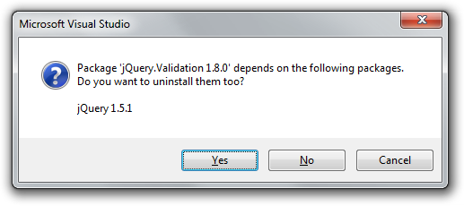
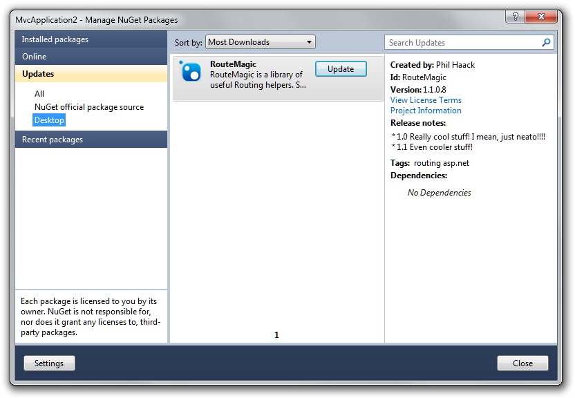

# NuGet 1.5 Release Notes

[NuGet 1.4 Release Notes](../release-notes/nuget-1.4.md) | [NuGet 1.6 Release Notes](../release-notes/nuget-1.6.md)

NuGet 1.5 was released on August 30, 2011.

## Features

### Project Templates with Preinstalled NuGet Packages
When creating a new ASP.NET MVC 3 project template, the jQuery script libraries included
in the project are actually placed there by installing NuGet packages.

The ASP.NET MVC 3 project template includes a set of NuGet packages that get installed
when the project template is invoked. This ability to include NuGet packages with a
project template is now a feature of NuGet that _any_ project template can now take
advantage of.

For more details about this feature, read this [blog post by the developer of the feature](https://blogs.msdn.com/b/marcinon/archive/2011/07/08/project-templates-and-preinstalled-nuget-packages.aspx).

### Explicit Assembly References

Added a new `<references />` element used to explicitly specify which assemblies within the
the package should be referenced.

For example, if you add the following:

```xml
<references>
    <reference file="xunit.dll" />
    <reference file="xunit.extensions.dll" />
</references>
```

Then only the `xunit.dll` and `xunit.extensions.dll` will be referenced from the appropriate
[framework/profile subfolder](../reference/nuspec.md#explicit-assembly-references)
of the `lib` folder even if there are other assemblies in the folder.

If this element is omitted, then the usual behavior applies, which is to reference every assembly
in the `lib` folder.

__What is this feature used for?__

This feature supports design-time only assemblies. For example, when using Code Contracts, the
contract assemblies need to be next to the runtime assemblies that they augment so that Visual
Studio can find them, but the contract assemblies should not actually be referenced by the project
and should not be copied into the `bin` folder.

Likewise, the feature can be used to for unit test frameworks such as XUnit which need its tools
assemblies to be located next to the runtime assemblies, but excluded from project references.

### Added ability to exclude files in the .nuspec
The `<file>` element within a `.nuspec` file can be used to include a specific file or a set of files
using a wildcard. When using a wildcard, there's no way to exclude a specific subset of the included
files. For example, suppose you want all text files within a folder except a specific one.

```xml
<files>
    <file src="*.txt" target="content\docs" exclude="admin.txt" />
</files>
```

Use semicolons to specify multiple files.

```xml
<files>
    <file src="*.txt" target="content\docs" exclude="admin.txt;log.txt" />
</files>
```

Or use a wild card to exclude a set of files such as all backup files

```xml
<files>
    <file src="tools\*.*" target="tools" exclude="*.bak" />
</files>
```

### Removing packages using the dialog prompts to remove dependencies
When uninstalling a package with dependencies, NuGet prompts, allowing the removal of a package's
dependencies along with the package.




### `Get-Package` command improvement
The `Get-Package` command now supports a `-ProjectName` parameter. So the command

```
Get-Package –ProjectName A
```

will list all packages installed in project A.

### Support for Proxies that require authentication
When using NuGet behind a proxy that requires authentication, NuGet will now prompt for
proxy credentials. Entering credentials allows NuGet to connect to the remote repository.

### Support for Repositories that require authentication
NuGet now supports connecting to [private repositories](../hosting-packages/local-feeds.md)
that require basic or NTLM authentication.

Support for Digest authentication will be added in a future release.

### Performance improvements to the nuget.org repository
We've made several performance improvements to the nuget.org gallery to make package listing
and searching faster.

### Solution dialog project filtering
In the Solution-level dialog, when prompting for what projects to install, we only show
projects that are compatible with the selected package.

### Package Release Notes
NuGet packages now include support for release notes. The release notes only show up
when viewing _Updates_ for a package, so it doesn't make sense to add them to your
first release.



To add release notes to a package, use the new `<releaseNotes />` metadata element in your
NuSpec file.

### .nuspec &ltfiles /&gt; improvement
The `.nuspec` file now allows empty `<files />` element, which tells nuget.exe
not to include any file in the package.

## Bug Fixes
NuGet 1.5 had a total of 107 work items fixed. 103 of those were marked as bugs.

For a full list of work items fixed in NuGet 1.5, please view the ```[NuGet Issue Tracker for this release](http://nuget.codeplex.com/workitem/list/advanced?keyword=&status=All&type=All&priority=All&release=NuGet%201.5&assignedTo=All&component=All&sortField=Summary&sortDirection=Descending&page=0)```.

## Bug fixes worth noting:

* ```[Issue 1273](http://nuget.codeplex.com/workitem/1273)```: Made `packages.config` more version control
friendly by sorting packages alphabetically and removing extra whitespace.
* ```[Issue 844](http://nuget.codeplex.com/workitem/844)```: Version numbers are now normalized so that
`Install-Package 1.0` works on a package with the version `1.0.0`.
* ```[Issue 1060](http://nuget.codeplex.com/workitem/1060)```: When creating a package using nuget.exe,
the `-Version` flag overrides the `<version />` element.
