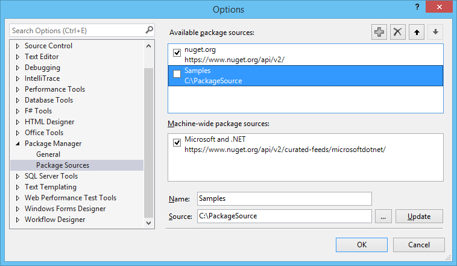

 # NuGet 1.6 Release Notes

[NuGet 1.5 Release Notes](../release-notes/nuget-1.5.md) | [NuGet 1.7 Release Notes](../release-notes/nuget-1.7.md)

NuGet 1.6 was released on December 13, 2011.

## Known Installation Issue
If you are running VS 2010 SP1, you might run into an installation error when attempting to upgrade
NuGet if you have an older version installed.

The workaround is to simply uninstall NuGet and then install it from the VS Extension Gallery.  See
<https://support.microsoft.com/kb/2581019> for more information.

Note: If Visual Studio won't allow you to uninstall the extension (the Uninstall button is disabled),
then you likely need to restart Visual Studio using "Run as Administrator."

## Features

### Support for Semantic Versioning and Prerelease Packages
NuGet 1.6 introduces support for Semantic Versioning (SemVer). For more details on how it uses
SemVer, read the [Versioning documentation](../create-packages/prerelease-packages.md).

### Using NuGet Without Checking In Packages (Package Restore)
NuGet 1.6 now has first class support for the workflow in which NuGet packages are not added
to source control, but instead are restored at build time if missing. For more details, read
the [Using NuGet without committing packages to source control](../consume-packages/packages-and-source-control.md)
topic.

### Item Templates That Install NuGet Packages
Building on the work to support preinstalled NuGet package to Visual Studio project templates,
NuGet 1.6 also adds support for Visual Studio item templates. Item templates can have associated
NuGet packages that are installed when the template in invoked.

For more details on how to change a project/item template to install NuGet packages, read the
[Packages in Visual Studio Templates](../visual-studio-extensibility/visual-studio-templates.md) topic.

### Support for disabling package sources
When multiple package sources are configured, NuGet will look in each one for packages during
installation of a package and its dependencies. A package source that is down for some reason
can severely slow down NuGet.

Prior to NuGet 1.6, you could remove the package source, but then you have to remember the details
for when you want to add it back in.

NuGet 1.6 allows unchecking a package source to disable it, but keep it around.

## Bug Fixes
NuGet 1.6 had a total of 106 work items fixed. 95 of those were classified as bugs and 10 of those were
features.

For a full list of work items fixed in NuGet 1.6, please view the [NuGet Issue Tracker for this release](https://nuget.codeplex.com/workitem/list/advanced?keyword=&status=Closed&type=All&priority=All&release=NuGet%201.6&assignedTo=All&component=All&sortField=Votes&sortDirection=Descending&page=0).
