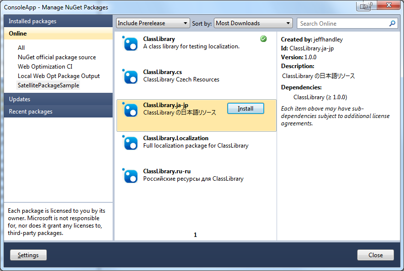
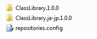
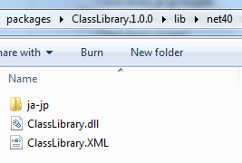
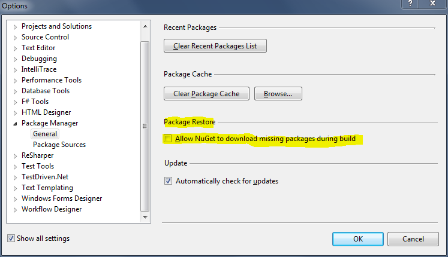

# NuGet 1.8 Release Notes

[NuGet 1.7 Release Notes](../release-notes/nuget-1.7.md) | [NuGet 2.0 Release Notes](../release-notes/nuget-2.0.md)

NuGet 1.8 was released on May 23, 2012.

## Known Installation Issue
If you are running VS 2010 SP1, you might run into an installation error when attempting to upgrade
NuGet if you have an older version installed.

The workaround is to simply uninstall NuGet and then install it from the VS Extension Gallery.  See
<https://support.microsoft.com/kb/2581019> for more information, or [go directly to the VS hotfix](http://bit.ly/vsixcertfix).

Note: If Visual Studio won't allow you to uninstall the extension (the Uninstall button is disabled),
then you likely need to restart Visual Studio using "Run as Administrator."

## NuGet 1.8 Incompatible with Windows XP, hotfix published

Shortly after NuGet 1.8 was released, we learned that a cryptography change in 1.8 broke users on Windows XP.

We have since released a hotfix that addresses this issue.  By updating NuGet through the Visual Studio Extension Gallery, you receive this hotfix.

## Features

### Satellite Packages for Localized Resources
NuGet 1.8 now supports the ability to create separate packages for localized resources, similar to the satellite assembly capabilities of the .NET Framework.  A satellite package is created in the same way as any other NuGet package with the addition of a few conventions:

* The satellite package ID and file name should include a suffix that matches one of the standard [culture strings used by the .NET Framework](/openspecs/windows_protocols/ms-lcid/a9eac961-e77d-41a6-90a5-ce1a8b0cdb9c).
* In its `.nuspec` file, the satellite package should define a language element with the same culture string used in the ID
* The satellite package should define a dependency in its `.nuspec` file to its core package, which is simply the package with the same ID minus the language suffix.  The core package needs to be available in the repository for successful installation.

To install a package with localized resources, a developer explicitly selects the localized package from the repository. At present, the NuGet gallery does not give any kind of special treatment to satellite packages.

Because the satellite package lists a dependency to its core package, both the satellite and core packages are pulled into the NuGet packages folder and installed.

Additionally, while installing the satellite package, NuGet also recognizes the culture string naming convention and then copies the localized resource assembly into the correct subfolder within the core package so that it can be picked by the .NET Framework.

One existing bug to note with satellite packages is that NuGet does not copy localized resources to the `bin` folder for Web site projects.  This issue will be fixed in the next release of NuGet.

For a complete sample demonstrating how to create and use satellite packages, see [https://github.com/NuGet/SatellitePackageSample](https://github.com/NuGet/SatellitePackageSample).

### Package Restore Consent
In NuGet 1.8, we laid the groundwork for supporting an important constraint on package restore to protect user privacy. This constraint requires developers building projects and solutions that are using package restore to explicitly consent to package restore’s going online to download packages from configured package sources.

There are 2 ways to provide this consent. The first can be found in the package manager configuration dialog as shown below.  This method is primarily intended for developer machines.

The second method is to set the environment variable “EnableNuGetPackageRestore” to the value “true”.  This method is intended for unattended machines such as CI or build servers.

Now, as stated above, we have only laid the groundwork for this feature in NuGet 1.8.  Practically, this means that while we’ve added all of the logic to enable the feature, it's not currently enforced in this version. It will be enabled, however, in the next release of NuGet, so we wanted to make you aware of it as soon as possible so that you can configure your environments appropriately and therefore not be impacted when we start enforce the consent constraint.

For more details, please see the [team blog post](http://blog.nuget.org/20120518/package-restore-and-consent.html) on this feature.

### nuget.exe Performance Improvements
By modifying the install command to download and install packages in parallel, NuGet 1.8 brings dramatic performance improvements to nuget.exe – and by extension package restore.  High level testing shows that performance for installing 6 packages into a project improves by about 35% in NuGet 1.8.  Increasing the number of packages to 25 shows a performance gain of about 60%.

## Bug Fixes
NuGet 1.8 includes quite a few bug fixes with an emphasis on the package manager console and package restore workflow, particularly as it relates to package restore consent and Windows 8 Express integration.