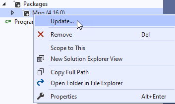
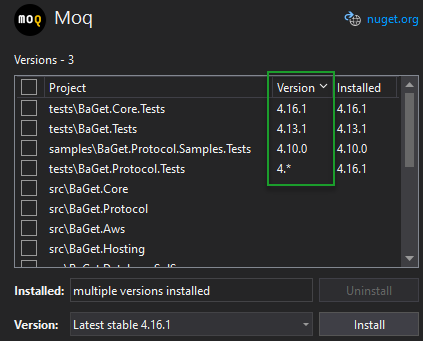

# NuGet 5.9 Release Notes

NuGet distribution vehicles:

| NuGet version | Available in Visual Studio version | Available in .NET SDK(s) |
|:---|:---|:---|
| [**5.9.0**](https://nuget.org/downloads) | [Visual Studio 2019 version 16.9](https://visualstudio.microsoft.com/downloads/) | [5.0.200](https://dotnet.microsoft.com/download/dotnet-core/5.0)1 |
| [**5.9.1**](https://nuget.org/downloads) | [Visual Studio 2019 version 16.9](https://visualstudio.microsoft.com/downloads/) | [5.0.202](https://dotnet.microsoft.com/download/dotnet-core/5.0)1 |
| [**5.9.2**](https://nuget.org/downloads) | [Visual Studio 2019 version 16.9.22](https://visualstudio.microsoft.com/downloads/) | N/A |
| [**5.9.3**](https://nuget.org/downloads) | N/A | N/A |

1 Installed with Visual Studio 2019 with .NET Core workload
  
> [!NOTE]
> Visual Studio 16.9, MSBuild 16.9, and .NET 5.0.200+ requires NuGet.exe 5.9 or later.

## Summary: What's New in 5.9.3

* [Security]: Microsoft Security Advisory CVE-2022-41032 | .NET Elevation of Privilege Vulnerability - [#12149](https://github.com/NuGet/Home/issues/12149)

## Summary: What's New in 5.9.2

* [Security]: Microsoft Security Advisory CVE-2022-30184 | .NET Information Disclosure Vulnerability - [#11883](https://github.com/NuGet/Home/issues/11883)

## Summary: What's New in 5.9

* Add "Update" context menu item for package dependencies that launches Package Manager UI with preselected packages to update - [#10378](https://github.com/NuGet/Home/issues/10378)

    

* Show the requested version (including floating version or version range request) in the "Version" column of the project list in the solution level Package Manager UI - [#9827](https://github.com/NuGet/Home/issues/9827)

    

* IntelliCode package suggestions in the Package Manager UI Browse tab released as an A/B test - [#10053](https://github.com/NuGet/Home/issues/10053)

* Extend the `.nupkg.metadata` file to include the installation source - [#10354](https://github.com/NuGet/Home/issues/10354)

* Introduce a new msbuild property to exclude build output for specific TFMs during pack task - [#10396](https://github.com/NuGet/Home/issues/10396)

### Issues fixed in this release

**DCRs(Design Change Request):**

* The down icon icon when the latest package version is installed is not intuitive. The old green tick was perfect - [#9789](https://github.com/NuGet/Home/issues/9789)

* Nuget Debug verbosity should say where a package came from - [#3055](https://github.com/NuGet/Home/issues/3055)

* NuGet pack should catch incorrect omitting of the dot in version numbers - [#9215](https://github.com/NuGet/Home/issues/9215)

* [CPVM] Disable pinning of the central transitive dependencies  - [#10132](https://github.com/NuGet/Home/issues/10132)

* net5 TFM: produce error when missing TPV - [#9441](https://github.com/NuGet/Home/issues/9441)

* Log package contenthash during restore logging (during extraction) - [#10384](https://github.com/NuGet/Home/issues/10384)

* Implement a pre-registration mechanism for legacy PR projects that call restore at solution open - [#9986](https://github.com/NuGet/Home/issues/9986)

* NuGet package recommender should work when more than one source is selected in package manager - [#10433](https://github.com/NuGet/Home/issues/10433)

* When restoring at normal verbosity, log which source a package is being restored from - [#10461](https://github.com/NuGet/Home/issues/10461)

**Bugs:**

* INuGetPackageFileService - Fetch Images and embedded licenses for Codespaces-connected and standalone - [#10151](https://github.com/NuGet/Home/issues/10151)

* VS OE:  IProjectMetadataContextInfo missing formatter - [#10079](https://github.com/NuGet/Home/issues/10079)

* [CPVM-Perf] Reduce the information written to centralTransitiveDependencyGroups - [#10002](https://github.com/NuGet/Home/issues/10002)

* Restore operations that throw due to a project not being loaded are reported as `NoOp` in telemetry - [#9985](https://github.com/NuGet/Home/issues/9985)

* Icons with certain color pallets causes PM UI to crash VS - [#10037](https://github.com/NuGet/Home/issues/10037)

* [CPVM-Perf] Reduce the PackageSpec clone when adding the CPVM information  - [#10003](https://github.com/NuGet/Home/issues/10003)

* PM UI - asyncify icon loading - [#10009](https://github.com/NuGet/Home/issues/10009)

* UI delay when loading icon URLs in PM UI - [#8505](https://github.com/NuGet/Home/issues/8505)

* Thread affinity in BitmapSource and WPF UI threads - [#9161](https://github.com/NuGet/Home/issues/9161)

* Warning for warning NU5128 when packastool with targetframework alias - [#10097](https://github.com/NuGet/Home/issues/10097)

* OutputPath logic in Pack targets in a customized build doesn't work properly - [#9234](https://github.com/NuGet/Home/issues/9234)

* VS OE:  cache IServiceBroker instance on client - [#10141](https://github.com/NuGet/Home/issues/10141)

* Make creating NuGetProjectActions for uninstall  from PM UI a parallel operation - [#9956](https://github.com/NuGet/Home/issues/9956)

* Performance: Reduce UIDelays in GetPackageSpecsAsync for Legacy projects and non PR projects - [#9953](https://github.com/NuGet/Home/issues/9953)

* ``dotnet nuget push *.nupkg`` doesn't push more than one file - [#4393](https://github.com/NuGet/Home/issues/4393)

* Output is wrapped at 80 characters on macOS when redirected - [#10198](https://github.com/NuGet/Home/issues/10198)

* Restore fails with -Source \<Relative Path\> - [#9406](https://github.com/NuGet/Home/issues/9406)

* netcoreapp5.0-windows does not round trip and does not parse platform information - [#10177](https://github.com/NuGet/Home/issues/10177)

* Custom CPS projects require AssemblyReferences project capability in order to restore. - [#8071](https://github.com/NuGet/Home/issues/8071)

* License and icon file existence check should always use a case-sensitive comparison - [#9817](https://github.com/NuGet/Home/issues/9817)

* DotnetCLiToolReference restores make it difficult to reason about no-op projects count/uptodateprojectscount - [#10038](https://github.com/NuGet/Home/issues/10038)

* Hard to see the dash-line box of package format when navigating by tab through the “Choose NuGet Package Manager Format” dialog in Dark theme - [#9729](https://github.com/NuGet/Home/issues/9729)

* Exclude transitive framework references from `CollectFrameworkReferences` - [#10314](https://github.com/NuGet/Home/issues/10314)

* Comparer static properties should be idempotent  - [#10339](https://github.com/NuGet/Home/issues/10339)

* resolve internal contracts assembly loading (fix RPS or get exception) - [#9919](https://github.com/NuGet/Home/issues/9919)

* Replace GetService with GetServiceAsync in NuGet.Clients, Part 1 - [#10362](https://github.com/NuGet/Home/issues/10362)

* CLI installs should not install unlisted packages - [#7466](https://github.com/NuGet/Home/issues/7466)

* Static msbuild graph restore - unnnecessary logging about MSBuildStartupDirectory - [#10335](https://github.com/NuGet/Home/issues/10335)

* Project Dependencies of ProjectReferences marked as PrivateAssets should not be included in the lock file up to date check - [#8565](https://github.com/NuGet/Home/issues/8565)

* SDK projects with bad data not showing restore errors in VS - [#10406](https://github.com/NuGet/Home/issues/10406)

* NU1004 when restoring a solution that has mixed Legacy and netstandard2 projects from cmd line with LockedMode - [#9623](https://github.com/NuGet/Home/issues/9623)

* Pack includes content brought in through dependency packages into the current project's package (SDK based projects only) - [#8867](https://github.com/NuGet/Home/issues/8867)

* Add telemetry for NuGet's VS extensibility API faults - [#10062](https://github.com/NuGet/Home/issues/10062)

* Add GenerateRestoreGraphFile in static graph restore to improve debugability.  - [#10365](https://github.com/NuGet/Home/issues/10365)

* Cannot open the NuGet Package manager - [#10336](https://github.com/NuGet/Home/issues/10336)

* NVDA/Narrator is not reading "License" label for "Apache-2.0" link - [#10425](https://github.com/NuGet/Home/issues/10425)

* The up to date status bar message is not great in VS - [#9402](https://github.com/NuGet/Home/issues/9402)

* packages.config package.lock.json uses an incorrect target framework - [#10257](https://github.com/NuGet/Home/issues/10257)

* Codespaces:  fix telemetry from https://github.com/NuGet/NuGet.Client/pull/3786 - [#10439](https://github.com/NuGet/Home/issues/10439)

* Error NU1004 disappears when building solution after enabling “RestoreLockedMode” - [#8973](https://github.com/NuGet/Home/issues/8973)

* Tabbing through PMUI in the reverse should mirror forward direction - [#10234](https://github.com/NuGet/Home/issues/10234)

* Debugging PMUI in Experimental Instance sometimes throws InvalidCastException from SolutionView to ProjectView - [#10416](https://github.com/NuGet/Home/issues/10416)

* The default version is null after clicking a deprecated package in Browse tab - [#10380](https://github.com/NuGet/Home/issues/10380)

* The NuGet manager in Visual Studio reloads when focus is regained - [#4176](https://github.com/NuGet/Home/issues/4176)

* Remove IPackageSourceProvider2 and related types - [#10098](https://github.com/NuGet/Home/issues/10098)

* Package 'NameOfPackage' is incompatible with 'all' frameworks in project - [#5127](https://github.com/NuGet/Home/issues/5127)

* CreateVersionsAsync does unnecessary NuGetVersion Compares - [#10436](https://github.com/NuGet/Home/issues/10436)

* NuGet.Client should replace using of ManagedImageMonikers with KnownMonikers - [#9977](https://github.com/NuGet/Home/issues/9977)

* The deprecated icon overlaps with the version of the deprecated package in Browse tab - [#10452](https://github.com/NuGet/Home/issues/10452)

* PackageReference NU1604 error handling is different across VS and command line (Restore & Package Manager UI) - [#9289](https://github.com/NuGet/Home/issues/9289)

* Codespaces:  necessary formatters not registered - [#10467](https://github.com/NuGet/Home/issues/10467)

* Remove net45 as as a target framework from NuGet.Frameworks - [#10470](https://github.com/NuGet/Home/issues/10470)

* Implementation - Add new telemetries to track events related to PMC and Powershell usage. - [#10142](https://github.com/NuGet/Home/issues/10142)

* Only one package shows in the Preview Changes window when there are multiple packages available to update in the Package Manager UI - [#10483](https://github.com/NuGet/Home/issues/10483)

* Empty frameworkReferences groups should be generated when packing multitargeted projects - [#10218](https://github.com/NuGet/Home/issues/10218)

* Hard to see the check-box of package in ‘Updates’ Tab is focused with a dash-line box when navigating through Tab in Blue/Blue (Extra Contrast)/Light themes - [#8963](https://github.com/NuGet/Home/issues/8963)

* Updates Tab checkboxes do not work well with screen-readers - [#10449](https://github.com/NuGet/Home/issues/10449)

* Updating in PMUI causes Object reference not set to an instance of an object - [#9882](https://github.com/NuGet/Home/issues/9882)

* Implementation - Add new telemetries to track events related to PMC and Powershell usage follow up. - [#10478](https://github.com/NuGet/Home/issues/10478)

* Copy-paste error in V2FeedPackageInfo - [#10480](https://github.com/NuGet/Home/issues/10480)

* NuGetPackageFileService fix - use using for disposable memorystream - [#10503](https://github.com/NuGet/Home/issues/10503)

**[List of all issues fixed in this release - 5.9.0](https://app.zenhub.com/workspaces/nuget-client-team-55aec9a240305cf007585881/reports/release?release=5f6be8c10485c0236b7ef889)**

**[List of commits in this release - 5.9.0](https://github.com/NuGet/NuGet.Client/compare/5.8.1.7021...5.9.0.7134)**

### Community contributions

Thank you to all the contributors who helped make this NuGet release awesome!

|Who|PRs|Issues|
|----|----|----|
[omajid](https://github.com/omajid) | [3865](https://github.com/NuGet/NuGet.Client/pull/3865) | Copy-paste error in V2FeedPackageInfo - [#10480](https://github.com/NuGet/Home/issues/10480)
[marcin-krystianc](https://github.com/marcin-krystianc) | [3812](https://github.com/NuGet/NuGet.Client/pull/3812) | Missing tests for the case where packages are referenced with PrivateAssets="All" attribute - [#10397](https://github.com/NuGet/Home/issues/10397)
[marcin-krystianc](https://github.com/marcin-krystianc) | [3739](https://github.com/NuGet/NuGet.Client/pull/3739) | Adding support for pushing multiple packages - [#4393](https://github.com/NuGet/Home/issues/4393)
[marcin-krystianc](https://github.com/marcin-krystianc) | [3723](https://github.com/NuGet/NuGet.Client/pull/3723) | Build of NuGet libraries is broken when assembly signing is disabled - [#10173](https://github.com/NuGet/Home/issues/10173)
[kant2002](https://github.com/kant2002) | [3807](https://github.com/NuGet/NuGet.Client/pull/3807) | Clean-up the contributing docs - [#10399](https://github.com/NuGet/Home/issues/10399)
[PathogenDavid](https://github.com/PathogenDavid) | [3754](https://github.com/NuGet/NuGet.Client/pull/3754) | License and icon file existence check should always use a case-sensitive comparison - [#9817](https://github.com/NuGet/Home/issues/9817)
[campersau](https://github.com/campersau) | [3677](https://github.com/NuGet/NuGet.Client/pull/3677) | Use BitmapCreateOptions.IgnoreColorProfile to workaround WPF issue when using DecodePixelWidth - [#10037](https://github.com/NuGet/Home/issues/10037)
[bjorkstromm](https://github.com/bjorkstromm) | [3697](https://github.com/NuGet/NuGet.Client/pull/3697) | Windows SDK 10 link is broken in NuGet.Client Contribution guide - [#10099](https://github.com/NuGet/Home/issues/10099)
[bjorkstromm](https://github.com/bjorkstromm) | [3696](https://github.com/NuGet/NuGet.Client/pull/3696) | Relative links are broken in NuGet.Client debugging guide - [#10100](https://github.com/NuGet/Home/issues/10100)
[Nirmal4G](https://github.com/Nirmal4G) | [3637](https://github.com/NuGet/NuGet.Client/pull/3637) | Improve test fixtures and related code - [#9996](https://github.com/NuGet/Home/issues/9996)
[rolfbjarne](https://github.com/rolfbjarne) | [3743](https://github.com/NuGet/NuGet.Client/pull/3743) | Output is wrapped at 80 characters on macOS when redirected - [#10198](https://github.com/NuGet/Home/issues/10198)
[xen2](https://github.com/xen2) | [2861](https://github.com/NuGet/NuGet.Client/pull/2861) | Make NuGet.PackageManagement available as a .NET Standard package - [#6150](https://github.com/NuGet/Home/issues/6150)
[Anipik](https://github.com/Anipik) | [3810](https://github.com/NuGet/NuGet.Client/pull/3810) | Introduce a new msbuild property to exclude build output for specific tfms during pack task - [#10396](https://github.com/NuGet/Home/issues/10396)

## Summary: What's New in 5.9.1

* "dotnet nuget remove source nuget.org" doesn't work the first time - [#10745](https://github.com/NuGet/Home/issues/10745)
* Make default validation disabled on Linux, but enabled by default on Windows - [#10713](https://github.com/NuGet/Home/issues/10713)

**[List of all issues fixed in this release - 5.9.1](https://app.zenhub.com/workspaces/nuget-client-team-55aec9a240305cf007585881/reports/release?release=6075f42efd068017639b4036)**

**[List of commits in this release - 5.9.1](https://github.com/NuGet/NuGet.Client/compare/5.9.0.7134...5.9.1.8)**

## Known issues

### nuget 5.9 pack raises `Null Reference` exception. - [#10685](https://github.com/NuGet/Home/issues/10685)

#### Issue
When tring to `pack` using a `.nuspec` file, `NuGet 5.9` version raises a `null reference` exception if [explicit assembly references](../reference/nuspec.md#explicit-assembly-references) are specified without adding any `reference groups` for projects that target `multiple frameworks`.

#### Workaround
Use `nuget.exe` [5.8.1](https://dist.nuget.org/win-x86-commandline/v5.8.1/nuget.exe)  or latest version other than `5.9.1`.

## Feedback welcome

Your feedback is important to us.  If there are any problems with this release, check our
[GitHub Issues](https://github.com/NuGet/Home/issues) and
[Visual Studio Developer Community](https://developercommunity.visualstudio.com/)
for existing issues.  For new issues within NuGet, please report a
[GitHub Issue](https://github.com/NuGet/Home/issues/new).
For general NuGet experience issues, let us know via the
[Report a Problem](/visualstudio/ide/how-to-report-a-problem-with-visual-studio)
option found in your favorite IDE under **Help > Report a Problem**.
