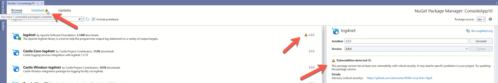

# NuGet 6.0 Release Notes

NuGet distribution vehicles:

| NuGet version | Available in Visual Studio version | Available in .NET SDK(s) |
|:---|:---|:---|
| [**6.0.0**](https://nuget.org/downloads) | [Visual Studio 2022 version 17.0.0](https://visualstudio.microsoft.com/downloads/) | [6.0.0](https://dotnet.microsoft.com/download/dotnet-core/6.0)<sup>1</sup> |
| **6.0.1** | [Visual Studio 2022 version 17.0.2](https://visualstudio.microsoft.com/downloads/) | N/A |
| [**6.0.2**](https://nuget.org/downloads) | [Visual Studio 2022 version 17.0.11](https://visualstudio.microsoft.com/downloads/) | [6.0.301](https://dotnet.microsoft.com/download/dotnet-core/6.0)<sup>1</sup> |
| [**6.0.3**](https://nuget.org/downloads) | [Visual Studio 2022 version 17.0](https://visualstudio.microsoft.com/downloads/) | [6.0.110](https://dotnet.microsoft.com/download/dotnet-core/6.0)<sup>1</sup> |
| [**6.0.5**](https://nuget.org/downloads) | N/A | [6.0.118](https://dotnet.microsoft.com/download/dotnet-core/6.0)<sup>1</sup> |
| [**6.0.6**](https://nuget.org/downloads) | N/A | [6.0.127](https://dotnet.microsoft.com/download/dotnet-core/6.0)<sup>1</sup> |

<sup>1</sup> Installed with Visual Studio 2022 with.NET Core workload

## Summary: What's New in 6.0.6

* [Security]: Microsoft Security Advisory CVE-2024-0057 | NuGet Client Security Feature bypass Vulnerability - [#12653](https://github.com/NuGet/Home/issues/13241)

## Summary: What's New in 6.0.5

* [Security]: Microsoft Security Advisory CVE-2023-29337 | NuGet Client Remote Code Execution Vulnerability - [#12653](https://github.com/NuGet/Home/issues/12653)

> [!NOTE]
> There is a behavior breaking change on Linux. The temp folder location, where NuGet stores temporary files during its various operations, has changed from `/tmp/NuGetScratch` to `/tmp/NuGetScratch<username>`. E.g. for user User1, the temp folder will be `/tmp/NuGetScratchUser1`.

## Summary: What's New in 6.0.3

* [Security]: Microsoft Security Advisory CVE-2022-41032 | .NET Elevation of Privilege Vulnerability - [#12149](https://github.com/NuGet/Home/issues/12149)

> [!NOTE]
> Visual Studio 17.0, MSBuild 17.0, and .NET 6.0 require NuGet.exe 6.0 or later.
## Summary: What's New in 6.0.2

* [Security]: Microsoft Security Advisory CVE 2022-30184 | .NET Information Disclosure Vulnerability - [#11883](https://github.com/NuGet/Home/issues/11883)

## Summary: What's New in 6.0.0

🎉 **This is the first release to offer full authoring and restoring support for NuGet packages targeting .NET 6.0** 🎉

### .NET 6 Support

NuGet 6.0 is the first release to offer full authoring and restoring support for NuGet packages targeting .NET 6.0. You can now target the following target frameworks:

*   net6.0
*   net6.0-windows
*   net6.0-android
*   net6.0-ios
*   net6.0-macos
*   net6.0-maccatalyst
*   net6.0-tvos
*   net6.0-tizen

  

If you aren’t familiar with the .NET 6.0 targets today or what it will look like in the future, don’t forget to check out the [.NET 6.0 TFM spec](https://github.com/dotnet/designs/blob/main/accepted/2021/net6.0-tfms/net6.0-tfms.md).

### Source Mapping

Earlier this year, many package managers became aware of [dependency confusion](https://medium.com/@alex.birsan/dependency-confusion-4a5d60fec610) attacks in which a user to be tricked into installing a malicious dependency instead of the one they intended to. To fortify your software supply chain against these attacks, the NuGet team has developed a new feature that allows you to map your dependencies to specific sources. Below is an example of how you can use source mapping to protect your projects.

<pre><code class="xml">&lt;!-- Define a global packages folder for your repository. --&gt;
&lt;!-- This is where installed packages will be stored locally. --&gt;
&lt;config&gt;
  &lt;add key="globalPackagesFolder" value="globalPackagesFolder" /&gt;
&lt;/config&gt;

&lt;!-- Define my package sources, nuget.org and contoso.com. --&gt;
&lt;!-- `clear` ensures no additional sources are inherited from another config file. --&gt;
&lt;packageSources&gt;
  &lt;clear /&gt;
  &lt;!-- `key` can be any identifier for your source. --&gt;
  &lt;add key="nuget.org" value="https://api.nuget.org/v3/index.json" /&gt;
  &lt;add key="contoso.com" value="https://contoso.com/packages/" /&gt;
&lt;/packageSources&gt;

&lt;!-- Define mappings by adding package ID patterns beneath the target source. --&gt;
&lt;!-- Contoso.* packages will be restored from contoso.com, everything else from nuget.org. --&gt;
&lt;packageSourceMapping&gt;
  &lt;!-- key value for &lt;packageSource&gt; should match key values from &lt;packageSources&gt; element --&gt;
  &lt;packageSource key="nuget.org"&gt;
    &lt;package pattern="*" /&gt;
  &lt;/packageSource&gt;
  &lt;packageSource key="contoso.com"&gt;
    &lt;package pattern="Contoso.*" /&gt;
  &lt;/packageSource&gt;
&lt;/packageSourceMapping&gt;
</code></pre>

You can read more about source mapping in our [blog released earlier this year](https://devblogs.microsoft.com/nuget/introducing-package-source-mapping/).

### Package Vulnerabilities in Visual Studio

When using the NuGet Package Manager within Visual Studio, you will now see package vulnerabilities for your packages including details such as the number and severity of vulnerabilities as well as direct links to learn more about the advisories.

  

### Retry & Backoff Behavior

There is now a `NUGET_ENABLE_EXPERIMENTAL_HTTP_RETRY` flag to improve the retry & backoff behavior of NuGet clients such as increasing the maximum amount of retries and increasing the delay for a more resilient experience when encountering a weaker internet connection.

### Exclude Default File Extensions

You can now use the MSBuild flag `<AllowedOutputExtensionsInPackageBuildOutputFolder>` to edit the file extensions included in the build output of your package. This gives you more control over the extensions being included in your build output folder.

### Improved Deprecation Information in Visual Studio

Deprecated packages in Visual Studio now include a link to the suggested alternate package to use. You can use this feature to quickly browse and install packages that are actively maintained.

  

### Add a Package README in Visual Studio

You can now add a package README.md file directly within Visual Studio. A README helps communicate important information about your package. It is often the first item a visitor will see when visiting your package on NuGet.org. README files typically include information on:

*   What the package does
*   Why the package is useful
*   How users can get started with the package
*   Where users can get help or contribute to your package

You can read more about [adding a README to your NuGet package on our blog](https://devblogs.microsoft.com/nuget/add-a-readme-to-your-nuget-package/).

### Faster Solution Load & Branch Switching in Visual Studio

In Visual Studio 2022, NuGet has redefined the contract between NuGet package restore and common Visual Studio components to improve performance for large solutions by only calling restore once instead of multiple times. This improves the time it takes for background processes to complete significantly.

Install the [Visual Studio 2022 Preview](https://visualstudio.microsoft.com/downloads/) and let us know if you notice a faster experience when loading your large solutions or switching between branches!

### NuGet's SolutionRestoreManager Visual Studio APIs moved into NuGet.VisualStudio package

NuGet.SolutionRestoreManager.Interop is no longer updated, and its APIs have been merged into the NuGet.VisualStudio package.
If you are updating an existing Visual Studio extension to work with Visual Studio 2022 (17.0), and you were previously using NuGet.SolutionRestoreManager.Interop, you should uninstall that package and upgrade/install NuGet.VisualStudio to version 6.0.0.
The namespaces and classes remain the same, so it's compatible from an API perspective.

Additionally, following [Visual Studio's change in policy](/visualstudio/extensibility/migration/migrated-assemblies?view=vs-2022&preserve-view=true), NuGet.VisualStudio no longer uses `EmbedInteropTypes`.
Therefore, your extension will have a compile time reference to NuGet.VisualStudio.dll.
Nuget instructs Visual Studio to use binding redirects, so your extension will not be affected when NuGet updates to newer versions and your extension is compiled against an older version of our assembly.
For this reason, you can suppress NuGet's assemblies from your vsix to reduce the download size.
NuGet's packages will be updated to do this automatically in NuGet 6.2 (for Visual Studio 17.2).

To suppress NuGet's assemblies from your vsix, add the following to your project file:

```xml
<ItemGroup>
  <SuppressFromVsix Include="NuGet.VisualStudio.dll" Visible="false" />
  <SuppressFromVsix Include="NuGet.VisualStudio.Contracts.dll" Visible="false" />
</ItemGroup>
```

**Features:**

* Add  hook for excluding certain build output extensions from the nuget package  - [#10690](https://github.com/NuGet/Home/issues/10690)

* Implement new precedence for xamarin TFMs when using net6.0+ - [#10717](https://github.com/NuGet/Home/issues/10717)

* Implement maccatalyst warning when "falling back" to xamarin.ios for net6.0+ projects - [#10718](https://github.com/NuGet/Home/issues/10718)

* Add package namespaces support as part of the configuration - add a reading capability only - [#10725](https://github.com/NuGet/Home/issues/10725)

* Package Namespaces: Account for package namespaces filtering in package downloading in PackageReference restore - [#10732](https://github.com/NuGet/Home/issues/10732)

* Add namespaces filtering support in packages.config restore in nuget.exe and msbuild /t:restore - [#10737](https://github.com/NuGet/Home/issues/10737)

* Add a contract for identifying a restore source, to help nuget better batch restores/branch switches.  - [#10807](https://github.com/NuGet/Home/issues/10807)

* Add support for net6.0-tizen and net6.0-android - [#10819](https://github.com/NuGet/Home/issues/10819)

* Add namespaces filtering support for packages.config restore in Visual Studio - [#10823](https://github.com/NuGet/Home/issues/10823)

* Add support for TfmSpecificDebugSymbolsFile to provide symbols in the inner build  - [#10913](https://github.com/NuGet/Home/issues/10913)

* Show warning icon in Installed tab if there are vulnerable packages installed - [#10982](https://github.com/NuGet/Home/issues/10982)

* Show warning icon by package in list of packages if there is a vulnerability - [#10983](https://github.com/NuGet/Home/issues/10983)

* Show package vulnerability details in the package details pane of the PMUI - [#10985](https://github.com/NuGet/Home/issues/10985)

* Add Deprecation Links in Details page in PM UI - [#10996](https://github.com/NuGet/Home/issues/10996)

* [Feature]: Make retry count and backoff behavior configurable for Nuget Clients  - [#11027](https://github.com/NuGet/Home/issues/11027)

* [Feature]: Address all the package installation rules for package namespaces work in PackageReference and PackageDownload scenarios. - [#11035](https://github.com/NuGet/Home/issues/11035)

* [Feature]: Address all the package installation rules for package namespaces work in Packages Config style projects - [#11036](https://github.com/NuGet/Home/issues/11036)

### Issues fixed in this release

**DCRs:**

* Consider removing the extensibility that allows other package managers to be shown as compatible - [#6623](https://github.com/NuGet/Home/issues/6623)

* Stop using EmbedInteropTypes for NuGet's VS extenbility packages/assemblies - [#10892](https://github.com/NuGet/Home/issues/10892)

* Project.nuget.g.targets should not prepend to MSBuildAllProjects in MSBuild 16 or later - [#10895](https://github.com/NuGet/Home/issues/10895)

* Remove obsolete core APIs - [#10940](https://github.com/NuGet/Home/issues/10940)

* Merge NuGet.SolutionRestoreManager.Interop into NuGet.VisualStudio - [#10957](https://github.com/NuGet/Home/issues/10957)

* Remove RuntimeEnvironmentHelper.IsDev14 - [#11000](https://github.com/NuGet/Home/issues/11000)

* Update Newtonsoft.Json to 13.0.1 - [#11095](https://github.com/NuGet/Home/issues/11095)

* [DCR]: Rename packageNamespaces feature to packageSourceMapping - [#11205](https://github.com/NuGet/Home/issues/11205)

**Bugs:**

* Installing with package save mode "nuspec" always reinstalls - [#2402](https://github.com/NuGet/Home/issues/2402)

* Update-Package -reinstall -ProjectName `<project>` does not work for PR - [#6088](https://github.com/NuGet/Home/issues/6088)

* "An item with the same key has already been added" - when project graph has projectName == packageRef name (of same version) - [#6795](https://github.com/NuGet/Home/issues/6795)

* [Test Failure] Suggest removing the second duplicated string “License Acceptance” in “License Acceptance” dialog - [#8162](https://github.com/NuGet/Home/issues/8162)

* Can't remove config key using nuget.exe - [#8223](https://github.com/NuGet/Home/issues/8223)

* msbuild /t:Restore and Visual Studio produce different assets files when assembly name != project name - [#8272](https://github.com/NuGet/Home/issues/8272)

* PM UI does not humanize the download count when 999,500 <= count <=999,999 - [#8800](https://github.com/NuGet/Home/issues/8800)

* Roslyn Analyzer suggestion "install with package manager" opens NuGet to wrong tab - [#10124](https://github.com/NuGet/Home/issues/10124)

* StaticGraph Restore should clearly call out when a project is not `KnownToBeMSBuildFormat` When Called via a Solution File - [#10363](https://github.com/NuGet/Home/issues/10363)

* The "nuget spec" command generates a .nuspec file with an iconUrl - [#10400](https://github.com/NuGet/Home/issues/10400)

* Rfc3161TimestampTokenInfo.GetNonce can throw - [#10484](https://github.com/NuGet/Home/issues/10484)

* Verify command is not disabled on Mono - [#10585](https://github.com/NuGet/Home/issues/10585)

* The CreateLockFileTargetLibrary method slows down the restore operation - [#10614](https://github.com/NuGet/Home/issues/10614)

* PackageArchieveReader doesn't override CopyNupkgAsync so package extraction fails - [#10708](https://github.com/NuGet/Home/issues/10708)

* Propagate package namespaces information to the restore command - [#10736](https://github.com/NuGet/Home/issues/10736)

* Ensure the namespaces filtering is respected in packages.config package installation/updates in PMUI - [#10738](https://github.com/NuGet/Home/issues/10738)

* NuGet.Packaging.Extraction:  exceptions from resources not found - [#10776](https://github.com/NuGet/Home/issues/10776)

* Cannot use embeded PackageReadmeFile when using snupkg for symbols - [#10791](https://github.com/NuGet/Home/issues/10791)

* Remove redundant UI delay switches in NuGet Project initialization - [#10824](https://github.com/NuGet/Home/issues/10824)

* Remove unnecessary ToList enumerations in restore codepaths - [#10835](https://github.com/NuGet/Home/issues/10835)

* Mark IVsPackageInstallerServices as deprecated - [#10836](https://github.com/NuGet/Home/issues/10836)

* NuGet packages downloaded over 1 billion times show the wrong unit - [#10864](https://github.com/NuGet/Home/issues/10864)

* Hard to see the background color of the number on the right of “Updates” and “Consolidate” tabs in the Dark theme - [#10896](https://github.com/NuGet/Home/issues/10896)

* IVsProjectRestoreInfoSource improvements  - [#10898](https://github.com/NuGet/Home/issues/10898)

* packages.lock.json broken with Sdk-Style C# project targeting net5.0-windows - [#10901](https://github.com/NuGet/Home/issues/10901)

* Add a default implementation for IVsSolutionRestoreService4 - [#10908](https://github.com/NuGet/Home/issues/10908)

* [Responsiveness] Remove implicit RPC from background thread via unneeded GetServiceAsync extensions - [#10916](https://github.com/NuGet/Home/issues/10916)

* Boxing of bool is to compute hashcode is causing excessive allocations - [#10917](https://github.com/NuGet/Home/issues/10917)

* Iterating over Library Dependencies is causing over-allocation of Enumerators - [#10918](https://github.com/NuGet/Home/issues/10918)

* Compatibility cache lookup allocates Func for each lookup - [#10919](https://github.com/NuGet/Home/issues/10919)

* Overallocations of WhereListIterator in DependencyWalker.CreateGraphNode - [#10920](https://github.com/NuGet/Home/issues/10920)

* Exception while restoring: "Restore metadata is mising the required target frameworks list" - [#10924](https://github.com/NuGet/Home/issues/10924)

* Share a framework reducer across managed code conventions - [#10925](https://github.com/NuGet/Home/issues/10925)

* NuGet VSIX is generated with incorrect binding redirects - [#10946](https://github.com/NuGet/Home/issues/10946)

* NuGet Package Manager UI delays when running init scripts - [#10947](https://github.com/NuGet/Home/issues/10947)

* Support sourceUri passed on nuget restore/install and dotnet restore package or other equivalent commands - [#10948](https://github.com/NuGet/Home/issues/10948)

* Namespaces filtering support for the nuget.exe install command - [#10961](https://github.com/NuGet/Home/issues/10961)

* Stop generating raw properties for every segment  - [#10969](https://github.com/NuGet/Home/issues/10969)

* Unexpected NU1605 from transitive reference that was never selected (pruned subgraph) - [#10972](https://github.com/NuGet/Home/issues/10972)

* NuGet.Localization has no package icon - [#10975](https://github.com/NuGet/Home/issues/10975)

* Avoid unnecessarily resizing dictionary while calculating project closure - [#10976](https://github.com/NuGet/Home/issues/10976)

* Conflicting documentation on ISettings.AddOrUpdate - [#10980](https://github.com/NuGet/Home/issues/10980)

* Use a pooled byte array when copying files and validating signatures - [#10988](https://github.com/NuGet/Home/issues/10988)

* Avoid Task.WhenAny allocations in dependency walker - [#10989](https://github.com/NuGet/Home/issues/10989)

* Ensure the namespaces filtering is respected in packages.config package installation/updates PMC - [#11001](https://github.com/NuGet/Home/issues/11001)

* Ensure the namespaces filtering is respected in packages.config package installation/updates IVs installer API - [#11002](https://github.com/NuGet/Home/issues/11002)

* [Bug]: PM UI shows 0 download count when selected package is already installed - [#11012](https://github.com/NuGet/Home/issues/11012)

* Reduce allocations in VersionFormatter - [#11014](https://github.com/NuGet/Home/issues/11014)

* Obsolete unused types: LibraryDependencyType and related - [#11015](https://github.com/NuGet/Home/issues/11015)

* [Bug]: `nuget.exe install packages.config` does not honor `-PackageSaveMode nuspec` - [#11018](https://github.com/NuGet/Home/issues/11018)

* [Bug]: `$(IsPackable)` is not quoted - [#11025](https://github.com/NuGet/Home/issues/11025)

* Create Apex tests with multi source repositories for PMUI Package namespace filtering - [#11026](https://github.com/NuGet/Home/issues/11026)

* [Bug]: [Accessibility] Hard to read links in PM UI search results using Light or Dark Theme - [#11055](https://github.com/NuGet/Home/issues/11055)

* IVsSolutionRestoreService4 should extend IVsSolutionRestoreService3 - [#11098](https://github.com/NuGet/Home/issues/11098)

* [Bug]: Advisory links should be aligned in details pane of PMUI - [#11101](https://github.com/NuGet/Home/issues/11101)

* Tooltip of the installed vulnerable/deprecation package versions’ warning icon is not clear - [#11103](https://github.com/NuGet/Home/issues/11103)

* [Responsiveness] RestoreOperationLogger+StatusBarProgress.Dispose blocking a thread pool thread waiting for UI thread - [#11115](https://github.com/NuGet/Home/issues/11115)

* Add time since last restore metric  - [#11124](https://github.com/NuGet/Home/issues/11124)

* [Bug]: nuget.exe regression in handling of recursive `<files>` entries between 5.9.1 and 5.10.0 - [#11125](https://github.com/NuGet/Home/issues/11125)

* Await WhenNominated when a project has a pending nomination - [#11132](https://github.com/NuGet/Home/issues/11132)

* Support sourceUri option passed on dotnet add package - [#11140](https://github.com/NuGet/Home/issues/11140)

* [Bug]: VS PM UI does not display JPEG icons for packages - [#11144](https://github.com/NuGet/Home/issues/11144)

* UIDelay: `nuget.packagemanagement.visualstudio.dll!NuGet.PackageManagement.VisualStudio.VsCoreProjectSystemReferenceReader+<GetProjectReferencesAsync>d__`  - CPS projects - [#11162](https://github.com/NuGet/Home/issues/11162)

* [Bug]: `dotnet list package --outdated --interactive` makes credential provider invalidate cache for every package listed - [#11169](https://github.com/NuGet/Home/issues/11169)

* [Bug]: Package namespaces for packages.config scenarios is using all the sources as fallback option when no matching namespaces are found for a package - [#11170](https://github.com/NuGet/Home/issues/11170)

* Avoid MEF lookups on UI thread during NuGet projects initialization - [#11176](https://github.com/NuGet/Home/issues/11176)

* [Bug]: Tooltip on the warning indicator image in the Installed tab no longer works - [#11183](https://github.com/NuGet/Home/issues/11183)

* All ServiceLocator calls that retrieve MEF services should avoid the UI thread. - [#11201](https://github.com/NuGet/Home/issues/11201)

* [Bug]: Telemetry event missing in Visual Studio - [#11206](https://github.com/NuGet/Home/issues/11206)

* Avoid duplicate EnvDTEProjectUtility.IsSupportedAsync calls  - [#11207](https://github.com/NuGet/Home/issues/11207)

* Add IVsSolutionManager.GetSolutionDirectoryAsync - improve performance and stop blocking the calling thread in async codepaths. - [#11208](https://github.com/NuGet/Home/issues/11208)

* Rename types/variables in the product/test code to reflect new name for package namespaces feature - [#11216](https://github.com/NuGet/Home/issues/11216)

* [Bug]: ArPow build doesn't work well when in a subdirectory of an unrelated git repository - [#11227](https://github.com/NuGet/Home/issues/11227)

* dotnet list package --vulnerable, --deprecated, --outdated does not work for transitive-only positives - [#10767](https://github.com/NuGet/Home/issues/10767)

**[List of all issues fixed in this release - 6.0](https://app.zenhub.com/workspaces/nuget-client-team-55aec9a240305cf007585881/reports/release?release=Z2lkOi8vcmFwdG9yL1JlbGVhc2UvNDMwMDQ)**

**[List of commits in this release - 6.0.0](https://github.com/NuGet/NuGet.Client/compare/5.11.0.17...6.0.0.280)**

## Summary: What's New in 6.0.1

Only Visual Studio was updated with this version of NuGet.

### Issues fixed in this release

* [Bug]: Cannot get INuGetProjectService from the service broker in Visual Studio 17 - [#11367](https://github.com/NuGet/Home/issues/11367)
* [Bug]: Package Manager Console initialization might cause deadlocks - [#11320](https://github.com/NuGet/Home/issues/11320)

**[List of commits in this release - 6.0.1](https://github.com/NuGet/NuGet.Client/compare/6.0.0.280...6.0.1.1)**

### Community contributions

Thank you to all the contributors who helped make this NuGet release awesome!

|Who|PRs|Issues|
|----|----|----|
[omajid](https://github.com/omajid) | [3866](https://github.com/NuGet/NuGet.Client/pull/3866) | Handle nonce being null in Rfc3161TimestampTokenInfo - [#10484](https://github.com/NuGet/Home/issues/10484)
[marcin-krystianc](https://github.com/marcin-krystianc) | [3934](https://github.com/NuGet/NuGet.Client/pull/3934) | Adding a cache for LockFileTargetLibrary - [#10614](https://github.com/NuGet/Home/issues/10614)
[krafs](https://github.com/krafs) | [4151](https://github.com/NuGet/NuGet.Client/pull/4151) | Removed return value from docs on ISettings.AddOrUpdate - [#10980](https://github.com/NuGet/Home/issues/10980)
[huangqinjin](https://github.com/huangqinjin) | [4148](https://github.com/NuGet/NuGet.Client/pull/4148) | Fix PackageSaveMode nuspec always reinstalls - [#2402](https://github.com/NuGet/Home/issues/2402)
[Insomniak47](https://github.com/Insomniak47) | [4190](https://github.com/NuGet/NuGet.Client/pull/4190) | fix(docs): Remove link to closed/dead-end link in Contributing guidelines - [#8987](https://github.com/NuGet/Home/issues/8987)
[marcin-krystianc](https://github.com/marcin-krystianc) | [4194](https://github.com/NuGet/NuGet.Client/pull/4194) | Make the performance scripts account for restore operation failures - [#9968](https://github.com/NuGet/Home/issues/9968)
[eriawan](https://github.com/eriawan) | [4159](https://github.com/NuGet/NuGet.Client/pull/4159) | Fixes Surround ($IsPackable) with single quotes - [#11025](https://github.com/NuGet/Home/issues/11025)
[huangqinjin](https://github.com/huangqinjin) | [4193](https://github.com/NuGet/NuGet.Client/pull/4193) | Install packages.config should honor PackageSaveMode - [#11018](https://github.com/NuGet/Home/issues/11018)
[mfkl](https://github.com/mfkl) | [4199](https://github.com/NuGet/NuGet.Client/pull/4199) | test: use new DependencyGraphSpec - [#11168](https://github.com/NuGet/Home/issues/11168)
[omajid](https://github.com/omajid) | [4254](https://github.com/NuGet/NuGet.Client/pull/4254) | Use --work-tree with git apply - [#11227](https://github.com/NuGet/Home/issues/11227)

## Feedback welcome

Your feedback is important to us.  If there are any problems with this release, check our
[GitHub Issues](https://github.com/NuGet/Home/issues) and
[Visual Studio Developer Community](https://developercommunity.visualstudio.com/)
for existing issues.  For new issues within NuGet, please report a
[GitHub Issue](https://github.com/NuGet/Home/issues/new/choose).
For general NuGet experience issues, let us know via the
[Report a Problem](/visualstudio/ide/how-to-report-a-problem-with-visual-studio)
option found in your favorite IDE under **Help > Report a Problem**.
