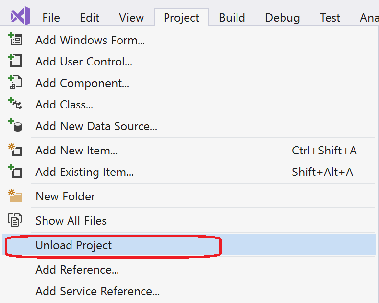

# Identify the project format

NuGet works with all .NET projects. However, the project format (SDK-style or non-SDK-style) determines some of the tools and methods that you need to use to consume and create NuGet packages. SDK-style projects use the [SDK attribute](/dotnet/core/tools/csproj#additions). It is important to identify your project type because the methods and tools you use to consume and create NuGet packages are dependent on the project format. For non-SDK-style projects, the methods and tools are also dependent on whether or not the project has been migrated to `PackageReference` format.

Whether your project is SDK-style or not depends on the method used to create the project. The following table shows the default project format and the associated CLI tool for your project when you create it using Visual Studio 2017 and later versions.

| Project&nbsp;&nbsp;&nbsp;&nbsp;&nbsp;&nbsp;&nbsp;&nbsp;&nbsp;&nbsp;&nbsp;&nbsp;&nbsp;&nbsp; | Default project format | CLI tool&nbsp;&nbsp;&nbsp;&nbsp;&nbsp;&nbsp;&nbsp;&nbsp;&nbsp; | Notes |
|:------------- |:-------------|:-----|:-----|
| .NET Standard | SDK-style | [dotnet SDK](../install-nuget-client-tools.md#dotnet-sdk) | Projects created prior to Visual Studio 2017 are non-SDK-style. Use `nuget.exe` CLI. |
| .NET Core | SDK-style | [dotnet SDK](../install-nuget-client-tools.md#dotnet-sdk) | Projects created prior to Visual Studio 2017 are non-SDK-style. Use `nuget.exe` CLI. |
| .NET Framework | Non-SDK-style | [nuget.exe CLI](../install-nuget-client-tools.md#nugetexe-cli) | .NET Framework projects created using other methods may be SDK-style projects. For these, use [dotnet SDK](../install-nuget-client-tools.md#dotnet-sdk) instead. |
| [Migrated](../consume-packages/migrate-packages-config-to-package-reference.md) .NET project | Non-SDK-style| To create packages, use [msbuild -t:pack](../consume-packages/migrate-packages-config-to-package-reference.md#create-a-package-after-migration) to create packages. | To create packages, `msbuild -t:pack` is recommended. Otherwise, use the [dotnet SDK](../install-nuget-client-tools.md#dotnet-sdk). Migrated projects are not SDK-style projects. |

## Check the project format

If you're unsure whether the project is SDK-style format or not, look for the SDK attribute in the `<Project>` element in the project file (For C#, this is the *.csproj file). If it is present, the project is an SDK-style project.

```xml
<Project Sdk="Microsoft.NET.Sdk">

  <PropertyGroup>
    <TargetFramework>netstandard2.0</TargetFramework>
    <Authors>authorname</Authors>
    <PackageId>mypackageid</PackageId>
    <Company>mycompanyname</Company>
  </PropertyGroup>

</Project>
```

## Check the project format in Visual Studio

If you are working in Visual Studio, you can quickly check the project format using one of the following methods:

- Right-click the project in Solution Explorer and select **Edit myprojectname.csproj**.

   This option is only available starting in Visual Studio 2017 for projects that use the SDK-style attribute. Otherwise, use the other method.

   

   An SDK-style project shows the [SDK attribute](/dotnet/core/tools/csproj#additions) in the project file.
   
- From the **Project** menu, choose **Unload Project** (or right-click the project and choose **Unload Project**).

   This project will not include the SDK attribute in the project file. It is not an SDK-style project.

   

   Then, right-click the unloaded project and choose **Edit myprojectname.csproj**.

## See also

- [Create .NET Standard Packages with dotnet CLI](../quickstart/create-and-publish-a-package-using-the-dotnet-cli.md)
- [Create .NET Standard Packages with Visual Studio](../quickstart/create-and-publish-a-package-using-visual-studio.md)
- [Create and publish a .NET Framework package (Visual Studio)](../quickstart/create-and-publish-a-package-using-visual-studio-net-framework.md)
- [NuGet pack and restore as MSBuild targets](../reference/msbuild-targets.md)
