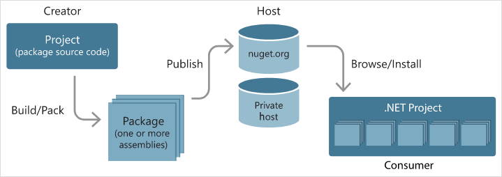
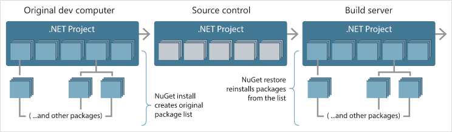

# An introduction to NuGet

An essential tool for any modern development platform is a mechanism through which developers can create, share, and consume useful code. Often such code is bundled into "packages" that contain compiled code (as DLLs) along with other content needed in the projects that consume these packages.

For .NET (including .NET Core), the Microsoft-supported mechanism for sharing code is **NuGet**, which defines how packages for .NET are created, hosted, and consumed, and [provides the tools](install-nuget-client-tools.md) for each of those roles.

Put simply, a NuGet package is a single ZIP file with the `.nupkg` extension that contains compiled code (DLLs), other files related to that code, and a descriptive manifest that includes information like the package's version number. Developers with code to share create packages and publish them to a public or private host. Package consumers obtain those packages from suitable hosts, add them to their projects, and then call a package's functionality in their project code. NuGet itself then handles all of the intermediate details.

Because NuGet supports private hosts alongside the public nuget.org host, you can use NuGet packages to share code that's exclusive to an organization or a work group. You can also use NuGet packages as a convenient way to factor your own code for use in nothing but your own projects. In short, a NuGet package is a shareable unit of code, but does not require nor imply any particular means of sharing.

## The flow of packages between creators, hosts, and consumers

In its role as a public host, NuGet itself maintains the central repository of over 100,000 unique packages at [nuget.org](https://www.nuget.org). These packages are employed by millions of .NET/.NET Core developers every day. NuGet also enables you to host packages privately in the cloud (such as on Azure DevOps), on a private network, or even on just your local file system. By doing so, those packages are available to only those developers that have access to the host, giving you the ability to make packages available to a specific group of consumers. The options are explained on [Hosting your own NuGet feeds](hosting-packages/overview.md). Through configuration options, you can also control exactly which hosts can be accessed by any given computer, thereby ensuring that packages are obtained from specific sources rather than a public repository like nuget.org.

Whatever its nature, a host serves as the point of connection between package *creators* and package *consumers*. Creators build useful NuGet packages and publish them to a host. Consumers then search for useful and compatible packages on accessible hosts, downloading and including those packages in their projects. Once installed in a project, the packages' APIs are available to the rest of the project code.

## Package targeting compatibility

A "compatible" package means that it contains assemblies built for at least one target .NET framework that's compatible with the consuming project's target framework. Developers can create packages that are specific to one framework, as with UWP controls, or they can support a wider range of targets. To maximize a package's compatibility, developers target [.NET Standard](/dotnet/standard/net-standard), which all .NET and .NET Core projects can consume. This is the most efficient means for both creators and consumers, as a single package (usually containing a single assembly) works for all consuming projects.

Package developers who require APIs outside of .NET Standard, on the other hand, create separate assemblies for the different target frameworks they want to support and include all of those assemblies in the same package (which is called "multi-targeting"). When a consumer installs such a package, NuGet extracts only those assemblies that are needed by the project. This minimizes the package's footprint in the final application and/or assemblies produced by that project. A multi-targeting package is, of course, more difficult for its creator to maintain.

> [!Note]
> For guidance on app components vs. reusable libraries, see the [.NET Standard documentation on the topic](/dotnet/standard/net-standard?branch=main#when-to-target-net50-vs-netstandard).

## NuGet tools

In addition to hosting support, NuGet also provides a variety of tools used by both creators and consumers. See [Installing NuGet client tools](install-nuget-client-tools.md) for how to obtain specific tools.

| Tool | Platforms | Applicable Scenarios | Description |
| --- | --- | --- | --- |
| [dotnet CLI](consume-packages/install-use-packages-dotnet-cli.md) | All | Creation, Consumption | CLI tool for .NET Core and .NET Standard libraries, and for SDK-style projects that target .NET Framework (see [SDK attribute](/dotnet/core/tools/csproj#additions)). Provides certain NuGet CLI capabilities directly within the .NET Core tool chain. As with the `nuget.exe` CLI, the dotnet CLI does not interact with Visual Studio projects. |
| [nuget.exe CLI](consume-packages/install-use-packages-nuget-cli.md) | All | Creation, Consumption | CLI tool for .NET Framework libraries and non-SDK-style projects that target .NET Standard libraries. Provides all NuGet capabilities, with some commands applying specifically to package creators, some applying only to consumers, and others applying to both. For example, package creators use the `nuget pack` command to create a package from various assemblies and related files, package consumers use `nuget install` to include packages in a project folder, and everyone uses `nuget config` to set NuGet configuration variables. As a platform-agnostic tool, the NuGet CLI does not interact with Visual Studio projects. |
| [Package Manager Console](consume-packages/install-use-packages-powershell.md) | Visual Studio on Windows | Consumption | Provides [PowerShell commands](reference/Powershell-Reference.md) for installing and managing packages in Visual Studio projects. |
| [Package Manager UI](consume-packages/install-use-packages-visual-studio.md) | Visual Studio on Windows | Consumption | Provides an easy-to-use UI for installing and managing packages in Visual Studio projects. |
| [Manage NuGet UI](/visualstudio/mac/nuget-walkthrough) | Visual Studio for Mac | Consumption | Provide an easy-to-use UI for installing and managing packages in Visual Studio for Mac projects. |
| [MSBuild](reference/msbuild-targets.md) | Windows | Creation, Consumption | Provides the ability to create packages and restore packages used in a project directly through the MSBuild tool chain. |

As you can see, the NuGet tools you work with depend greatly on whether you're creating, consuming, or publishing packages, and the platform on which you're working. Package creators are typically also consumers, as they build on top of functionality that exists in other NuGet packages. And those packages, of course, may in turn depend on still others.

For more information, start with the [Package creation workflow](create-packages/Overview-and-Workflow.md) and [Package consumption workflow](consume-packages/Overview-and-Workflow.md) articles.

## Managing dependencies

The ability to easily build on the work of others is one of most powerful features of a package management system. Accordingly, much of what NuGet does is managing that dependency tree or "graph" on behalf of a project. Simply said, you need only concern yourself with those packages that you're directly using in a project. If any of those packages themselves consume other packages (which can, in turn, consume still others), NuGet takes care of all those down-level dependencies.

The following image shows a project that depends on five packages, which in turn depend on a number of others.

Notice that some packages appear multiple times in the dependency graph. For example, there are three different consumers of package B, and each consumer might also specify a different version for that package (not shown). This is a common occurrence, especially for widely-used packages. NuGet fortunately does all the hard work to determine exactly which version of package B satisfies all consumers. NuGet then does the same for all other packages, no matter how deep the dependency graph.

For more details on how NuGet performs this service, see [Dependency resolution](concepts/dependency-resolution.md).

## Tracking references and restoring packages

Because projects can easily move between developer computers, source control repositories, build servers, and so forth, it's highly impractical to keep the binary assemblies of NuGet packages directly bound to a project. Doing so would make each copy of the project unnecessarily bloated (and thereby waste space in source control repositories). It would also make it very difficult to update package binaries to newer versions as updates would have to be applied across all copies of the project.

NuGet instead maintains a simple reference list of the packages upon which a project depends, including both top-level and down-level dependencies. That is, whenever you install a package from some host into a project, NuGet records the package identifier and version number in the reference list. (Uninstalling a package, of course, removes it from the list.) NuGet then provides a means to restore all referenced packages upon request, as described on [Package restore](consume-packages/package-restore.md).

With only the reference list, NuGet can then reinstall&mdash;that is, *restore*&mdash;all of those packages from public and/or private hosts at any later time. When committing a project to source control, or sharing it in some other way, you include only the reference list and exclude any package binaries (see [Packages and source control](consume-packages/packages-and-source-control.md).)

The computer that receives a project, such as a build server obtaining a copy of the project as part of an automated deployment system, simply asks NuGet to restore dependencies whenever they're needed. Build systems like Azure DevOps provide "NuGet restore" steps for this exact purpose. Similarly, when developers obtain a copy of a project (as when cloning a repository), they can invoke command like `nuget restore` (NuGet CLI), `dotnet restore` (dotnet CLI), or `Install-Package` (Package Manager Console) to obtain all the necessary packages. Visual Studio, for its part, automatically restores packages when building a project (provided that automatic restore is enabled, as described on [Package restore](consume-packages/package-restore.md)).

Clearly, then, NuGet's primary role where developers are concerned is maintaining that reference list on behalf of your project and providing the means to efficiently restore (and update) those referenced packages. This list is maintained in one of two *package management formats*, as they're called:

- [PackageReference](consume-packages/package-references-in-project-files.md) (or "package references in project files") | *(NuGet 4.0+)* Maintains a list of a project's top-level dependencies directly within the project file, so no separate file is needed. An associated file, `obj/project.assets.json`, is dynamically generated to manage the overall dependency graph of the packages that a project uses along with all down-level dependencies. PackageReference is always used by .NET Core projects.

- [`packages.config`](reference/packages-config.md): *(NuGet 1.0+)* An XML file that maintains a flat list of all dependencies in the project, including the dependencies of other installed packages. Installed or restored packages are stored in a `packages` folder.

Which package management format is employed in any given project depends on the project type, and the available version of NuGet (and/or Visual Studio). To check what format is being used, simply look for `packages.config` in the project root after installing your first package. If you don't have that file, look in the project file directly for a \<PackageReference\> element.

When you have a choice, we recommend using PackageReference. `packages.config` is maintained for legacy purposes and is no longer under active development.

> [!Tip]
> Various `nuget.exe` CLI commands, like `nuget install`, do not automatically add the package to the reference list. The list is updated when installing a package with the Visual Studio Package Manager (UI or Console), and with `dotnet.exe` CLI.

## What else does NuGet do?

So far you've learned the following characteristics of NuGet:

- NuGet provides the central nuget.org repository with support for private hosting.
- NuGet provides the tools developers need for creating, publishing, and consuming packages.
- Most importantly, NuGet maintains a reference list of packages used in a project and the ability to restore and update those packages from that list.

To make these processes work efficiently, NuGet does some behind-the-scenes optimizations. Most notably, NuGet manages a package cache and a global packages folder to shortcut installation and reinstallation. The cache avoids downloading a package that's already been installed on the machine. The global packages folder allows multiple projects to share the same installed package, thereby reducing NuGet's overall footprint on the computer. The cache and global packages folder are also very helpful when you're frequently restoring a larger number of packages, as on a build server. For more details on these mechanisms, see [Managing the global packages and cache folders](consume-packages/managing-the-global-packages-and-cache-folders.md).

Within an individual project, NuGet manages the overall dependency graph, which again includes resolving multiple references to different versions of the same package. It's quite common that a project takes a dependency on one or more packages that themselves have the same dependencies. Some of the most useful utility packages on nuget.org are employed by many other packages. In the entire dependency graph, then, you could easily have ten different references to different versions of the same package. To avoid bringing multiple versions of that package into the application itself, NuGet sorts out which single version can be used by all consumers. (For more information, see [Dependency Resolution](concepts/dependency-resolution.md).)

Beyond that, NuGet maintains all the specifications related to how packages are structured (including [localization](create-packages/creating-localized-packages.md) and [debug symbols](create-packages/symbol-packages-snupkg.md)) and how they are [referenced](consume-packages/package-references-in-project-files.md) (including [version ranges](concepts/package-versioning.md#version-ranges) and [pre-release versions](create-packages/prerelease-packages.md).) NuGet also provides various APIs to work with its services programmatically, and provides support for developers who write Visual Studio extensions and project templates.

Take a moment to browse the table of contents for this documentation, and you see all of these capabilities represented there, along with release notes dating back to NuGet's beginnings.

## Related video

Find NuGet videos on [Channel 9](/shows/NuGet-101/) and [YouTube](https://www.youtube.com/playlist?list=PLdo4fOcmZ0oVLvfkFk8O9h6v2Dcdh2bh_).

## Comments, contributions, and issues

Finally, we very much welcome comments and contributions to this documentation&mdash;just select the **Feedback** and **Edit** commands on the top of any page, or visit the [docs repository](https://github.com/NuGet/docs.microsoft.com-nuget/) and [docs issue list](https://github.com/NuGet/docs.microsoft.com-nuget/issues) on GitHub.

We also welcome contributions to NuGet itself through its [various GitHub repositories](https://github.com/NuGet/Home); NuGet issues can be found on [https://github.com/NuGet/home/issues](https://github.com/NuGet/home/issues).

Enjoy your NuGet experience!
